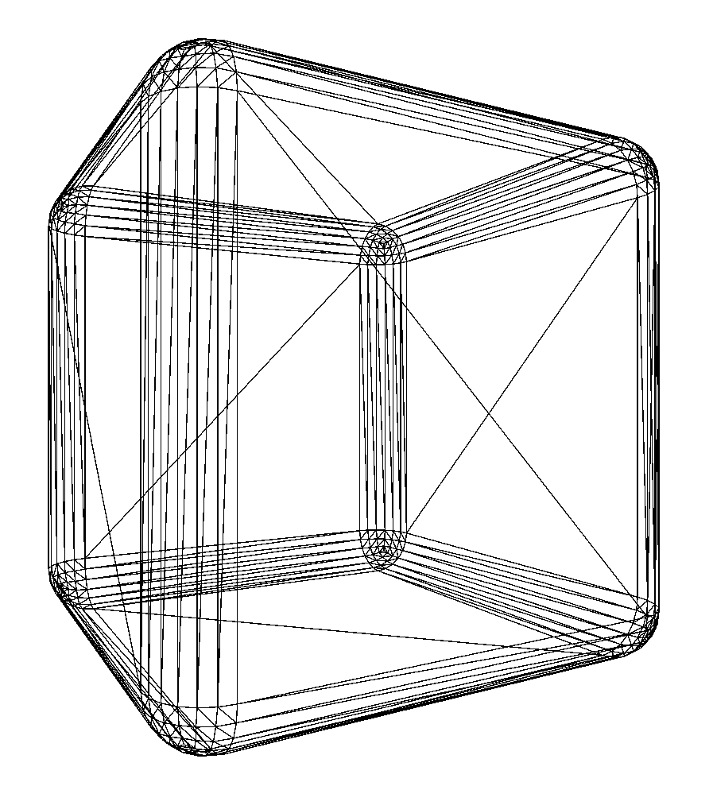
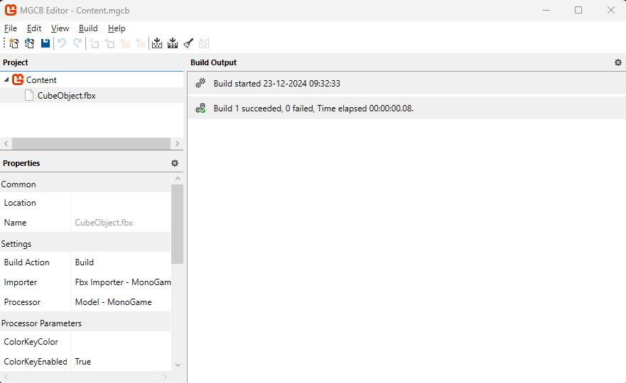
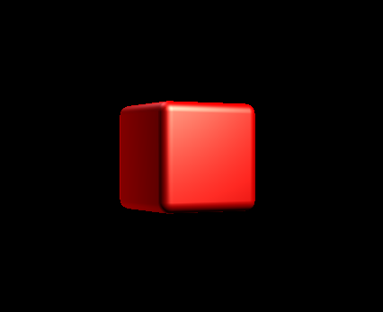

# The Cube 3D model
Right! Time to get some visuals on our screen! 

## The model
For model creation I use [Blender](https://www.blender.org/)- This tutorial isn't about Blender, there are lots of those out there on YouTube. 

I made a simple cube and used the bevel tool to give it nice rounded edges. Also, I scaled the cube so the sides are 0.2 world units wide. This isn't really nessecary- but I took that into account when calculating the coordinates in my game.



### Exporting from Blender
It is worth noting that the Monogame pipeline can import a few formats, I settled with the FBX format. In Blender you can export the model but keep in mind that **Y is UP** and **-Z is forward**. For our simple cube- where all sides are equal this isn't much of a deal.

## Adding the model to your game
As any other asset, you can import the .fbx file in your Content Manager tool:



I prefer to have a class to load the content (I'll expand on that later):
```csharp
    internal static class Models
    {
        public static Model CubeObject;

        public static void Initialize(ContentManager content)
        {
            CubeObject = content.Load<Model>("CubeObject");
        }
    }
```
and initialize my content in the `GameRoot.LoadContent()`:
```csharp
        protected override void LoadContent()
        {
            // ...

            Models.Initialize(Content);

            // ...
        }
```

So what do we need to actually draw the model? As shown in the [3D basics](1-2-ThreeDeeBasics.md), we will need a camera, a shader (in the shape of the builtin `BasicEffect`) and the object world Matrix. 
So let's get going:

#### The Camera
We've made a [camera class](1-2-ThreeDeeBasics.md#camera-object), so it is as simple as:
```csharp
        protected override void LoadContent()
        {
            // ...

            Camera = new Camera(new Vector3(0,0,5),new Vector3(0,0,-5),_graphics.PreferredBackBufferWidth,_graphics.PreferredBackBufferHeight, MathHelper.ToRadians(60));

            // ...
        }
```
In this piece of code, I put the camera at (0,0,5) world coordinates, and have it look back into the direction of the origin towards (0,0,-5). The aspect ratio will be calculated from the screen dimensions and I choose a field of view of 60 degrees, which gives a natural viewing angle in a static game.
The camera class will provide us with the **view** and **projection** matrices.

#### The shader
We're going to use the BasicEffect, so let's add that one. I've added it as `public static BasicEffect` in the `GameRoot` so I can access it elsewhere.

The BasicEffect has some parameters we want to set so our game looks better. So let's set some parameters:
```csharp
        protected override void LoadContent()
        {
            // ...

            // Use the Monogame Basic Effect:
            BasicEffect = new BasicEffect(GraphicsDevice);

            // The Camera is static, so we only need to set it once.
            BasicEffect.View = Camera.View;
            BasicEffect.Projection = Camera.Projection;

            // Setup some shader parameters to create a nice effect.
            BasicEffect.EnableDefaultLighting();
            BasicEffect.PreferPerPixelLighting = true;
            BasicEffect.SpecularPower = 16f;

            // ...
        }
```
We're telling the BasicEffect to set up some lights- the default light settings are fine. Also we set a value for the specular effect- it gives the cube a nice hilight.

#### Rendering the cube!
The LoadContent should look like this:
```csharp
        protected override void LoadContent()
        {
            _spriteBatch = new SpriteBatch(GraphicsDevice);

            Models.Initialize(Content);

            Camera = new Camera(new Vector3(0,0,5),new Vector3(0,0,-5),_graphics.PreferredBackBufferWidth,_graphics.PreferredBackBufferHeight, MathHelper.ToRadians(60));

            // Use the Monogame Basic Effect:
            BasicEffect = new BasicEffect(GraphicsDevice);

            // The Camera is static, so we only need to set it once.
            BasicEffect.View = Camera.View;
            BasicEffect.Projection = Camera.Projection;

            // Setup some shader parameters to create a nice effect.
            BasicEffect.EnableDefaultLighting();
            BasicEffect.PreferPerPixelLighting = true;
            BasicEffect.SpecularPower = 16f;
        }
```

To get the Cube on the screen, let's shift to the `Draw()` method:
```csharp
        protected override void Draw(GameTime gameTime)
        {
            GraphicsDevice.Clear(Color.Black);

            // Draw the cube mesh.
            foreach (ModelMesh m in Assets.Models.CubeObject.Meshes)
            {
                // This is generic- eventhough the cube only has one meshpart, 
                // Let's keep the code so you can experiment with different models.
                foreach (ModelMeshPart part in m.MeshParts)
                {

                    part.Effect = BasicEffect;
                    BasicEffect.World = Matrix.CreateScale(5) * Matrix.CreateRotationY(0.5f)*Matrix.CreateTranslation(0,0,-3f);
                    BasicEffect.DiffuseColor = Color.Red.ToVector3();
                }
                m.Draw();
            }

            base.Draw(gameTime);
        }
```
A 3D model is based on a mesh- the collection of vertices and their relation to eachother. Meshes can contain submeshed (for example a spaceship could have the hull and the exhaust as different meshparts). So we iterate over all mesh data in the model and assign the shader effect to each meshpart. 

Then we assign the World matrix: Move the cube to the coordinates (0,0,-3), rotate the cube a bit around the Y axis and increase the scale by 5.
Finally we tell the shader to color this cube Red. Shaders don't "know" colors, so RGB is represented as a Vector3.

Finally with all data set in the shader for this model- we draw it. 

When we run the code, it should look like this:



## Next steps
Let's take this tutorial a bit further by implementing the scene system as [mentioned before](1-1-GameEngineBasics.md#scene-management).

To improve our game, we will create a TitleScreen with a spinning cube. So add:
```csharp
    internal class TitleScreen : IScene
    {
        // Let's rotate the cube for a nice visual effect.
        private float _angle;

        public TitleScreen() 
        { 
        }

        public void Update(GameTime gameTime)
        {
            // Increase the angle framerate independant:
            // 0.75 radians per second, also keep the rotation within the 2 PI bound.
            _angle += 0.75f * (float)gameTime.ElapsedGameTime.TotalSeconds;
            _angle %= MathHelper.TwoPi;
        }


        public void Draw(SpriteBatch spriteBatch, GameTime gameTime)
        {

            // Draw the cube mesh.
            foreach (ModelMesh m in Assets.Models.CubeObject.Meshes)
            {
                // This is generic- eventhough the cube only has one meshpart, 
                // Let's keep the code so you can experiment with different models.
                foreach (ModelMeshPart part in m.MeshParts)
                {
                    part.Effect = GameRoot.BasicEffect;

                    GameRoot.BasicEffect.World = Matrix.CreateScale(5) * Matrix.CreateRotationY(_angle)*Matrix.CreateTranslation(0,0,-3f);

                    GameRoot.BasicEffect.DiffuseColor = Color.Red.ToVector3();
                }
                m.Draw();
            }
        }
    }
```
You will notice a lot of familiar pieces of code- the `Update()` and `Draw()` are there to keep the game running.

Let's include the SceneManager in the `GameRoot`:
```csharp
    public static SceneManager SceneManager;
```

Add the following lines at the end of the `ContentLoad()` method in `GameRoot`:
```csharp
            TitleScreen titleScreen = new TitleScreen();
            SceneManager.PushScene(titleScreen);
```
Change the update and draw functions like this:
```csharp
        protected override void Update(GameTime gameTime)
        {
            if (GamePad.GetState(PlayerIndex.One).Buttons.Back == ButtonState.Pressed || Keyboard.GetState().IsKeyDown(Keys.Escape))
                Exit();

            SceneManager.Update(gameTime);

            base.Update(gameTime);
        }

        protected override void Draw(GameTime gameTime)
        {
            GraphicsDevice.Clear(Color.Black);

            SceneManager.Draw(_spriteBatch, gameTime);

            base.Draw(gameTime);
        }
```

Run the code, and the cube should be spinning! 

