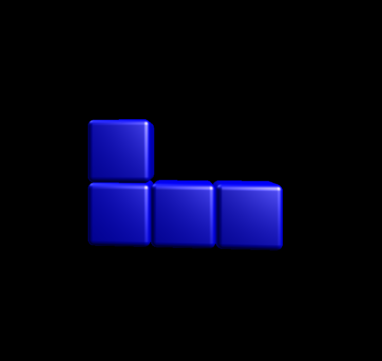

# Tetriminos
The core of the game are these shapes you can rotate and fit together. These shapes are called tetriminoes. Let's start with the base- the Tetromino class. We need something to represent the actual shape, and rotate between them.

> In Tetris each of the pieces, tertiminoes, are referred to as:
> J, L, I, O, T, S and Z

```csharp
    public enum Tetriminoes
    {
        I,
        O,
        T,
        J,
        L,
        S,
        Z
    }
```

## Shapes
We define the shape in each of the orientations by a pattern of booleans.

Let's have a look at the T tetrimono, it consists of 4 shapes- one for each orientation:
```
.1.     .1.     ...     .1.
111     .11     111     11.
...     .1.     .1.     .1.
```
The O tetrimono is the same in every rotation, and looks like this:
```
11
11
```

Therefore, not all tetriminoes have the same dimensions and the same number of shapes.
So to represent a single shape as a class:
```csharp
    internal class Shape
    {
        public bool[][] shapeBit;

        public Shape(bool[][] shapebits)
        {
            shapeBit = shapebits;
        }
    }
```
To make things a bit easier, this constructor takes a set of strings to construct the bit pattern:
```csharp
        public Shape(string[] shapedefinition)
        {
            shapeBit =new bool[shapedefinition.Length][];
            int j = 0;
            foreach (string s in shapedefinition)
            {
                shapeBit[j]=new bool[shapedefinition.Length];
                int i = 0;
                foreach (char c in s)
                {
                    shapeBit[j][i] = (c == '1');
                    i++;
                }
                j++;
            }
        }
```

## Tetrimino class
And the shapes together are representing a tetrimino.
```csharp
    internal class Tetrimino
    {
        public Shape[] Shapes; // the shape definitions
        private int _shapeID; //the current active shape
        public Color Color; //each tetrimino has its own color
        public Tetriminoes ShapeType; //what shape is it?

        public Tetrimino()
        {
            _shapeID = 0;
        }

        public Shape CurrentShape
        {
            get
            {
                return Shapes[_shapeID];
            }
        }

        public void SetShape(Shape[] shapes, Tetriminoes type, Color color)
        {
            Shapes = shapes;
            ShapeType = type;
            Color = color;
        }

        public void RotateLeft()
        {
            _shapeID++;
            if (_shapeID > Shapes.Length - 1)
            {
                _shapeID = 0;
            }
        }

        public void RotateRight()
        {
            _shapeID--;
            if (_shapeID < 0)
            {
                _shapeID = Shapes.Length - 1;
            }
        }
    }
```

## The factory
To produce a bunch of these pieces we're going to use a factory class. A factory is a pattern that instantiates a new object and sets the right properties for you. Look at the code below to see what I mean:
```csharp
    internal class TetriminoFactory
    {


        public TetriminoFactory()
        {
        }

        public Tetrimino Generate(Tetriminoes shapetype)
        {
            Shape[] shapes=new Shape[4];
            Color color=Color.White;

            switch (shapetype)
            {
                // I - the long one
                case Tetriminoes.I:
                    {
                        color = Color.Cyan;
                        shapes[0] = new Shape(new string[]
                        {
                            "0000",
                            "1111",
                            "0000",
                            "0000"
                        });
                        shapes[1] = new Shape(new string[] 
                        { 
                            "0010",
                            "0010",
                            "0010",
                            "0010"
                        });
                        shapes[2] = new Shape(new string[]
                        {
                            "0000",
                            "0000",
                            "1111",
                            "0000"
                        });
                        shapes[3] = new Shape(new string[]
                        {
                            "0100",
                            "0100",
                            "0100",
                            "0100"
                        });

                        break;
                    }

                    case Tetriminoes.O:
                    {
                        color = Color.Yellow;
                        shapes = new Shape[1];
                        shapes[0] = new Shape(new string[]
                        {
                            "11",
                            "11",
                        });
                        break;
                    }

                case Tetriminoes.T:
                    {
                        color = Color.DeepPink;
                        shapes[0] = new Shape(new string[]
                        {
                            "010",
                            "111",
                            "000"
                        });
                        shapes[1] = new Shape(new string[]
                        {
                            "010",
                            "011",
                            "010"
                        });
                        shapes[2] = new Shape(new string[]
                        {
                            "000",
                            "111",
                            "010"
                        });
                        shapes[3] = new Shape(new string[]
                        {
                            "010",
                            "110",
                            "010"
                        });
                        break;
                    }

                case Tetriminoes.J:
                    {
                        color = Color.Blue;
                        shapes[0] = new Shape(new string[]
                        {
                            "100",
                            "111",
                            "000"
                        });
                        shapes[1] = new Shape(new string[]
                        {
                            "011",
                            "010",
                            "010"
                        });
                        shapes[2] = new Shape(new string[]
                        {
                            "000",
                            "111",
                            "001"
                        });
                        shapes[3] = new Shape(new string[]
                        {
                            "010",
                            "010",
                            "110"
                        });
                        break;
                    }
                case Tetriminoes.L:
                    {
                        color = Color.Orange;
                        shapes[0] = new Shape(new string[]
                        {
                            "001",
                            "111",
                            "000"
                        });
                        shapes[1] = new Shape(new string[]
                        {
                            "010",
                            "010",
                            "011"
                        });
                        shapes[2] = new Shape(new string[]
                        {
                            "000",
                            "111",
                            "100"
                        });
                        shapes[3] = new Shape(new string[]
                        {
                            "110",
                            "010",
                            "010"
                        });

                        break;
                    }
                case Tetriminoes.S:
                    {
                        color = Color.Green;
                        shapes[0] = new Shape(new string[]
                        {
                            "011",
                            "110",
                            "000"
                        });
                        shapes[1] = new Shape(new string[]
                        {
                            "010",
                            "011",
                            "001"
                        });
                        shapes[2] = new Shape(new string[]
                        {
                            "000",
                            "011",
                            "110"
                        });
                        shapes[3] = new Shape(new string[]
                        {
                            "100",
                            "110",
                            "010"
                        });

                        break;
                    }
                case Tetriminoes.Z:
                    {
                        color = Color.Red;
                        shapes[0] = new Shape(new string[]
                        {
                            "110",
                            "011",
                            "000"
                        });
                        shapes[1] = new Shape(new string[]
                        {
                            "001",
                            "011",
                            "010"
                        });
                        shapes[2] = new Shape(new string[]
                        {
                            "000",
                            "110",
                            "011"
                        });
                        shapes[3] = new Shape(new string[]
                        {
                            "010",
                            "110",
                            "100"
                        });

                        break;
                    }


            }

            Tetrimino t = new Tetrimino();
            t.SetShape(shapes,shapetype,color);

            return t;
        }
    }
   
```
Now, whenever we need a tetrimino, we can ask the factory for a type! Very convenient!

## Drawing the tetrimino
Finally we want to draw the tetrimino, so let's add the Draw method to the tetrimono class:
```csharp
        public void Draw(Matrix world)
        {
            for (int y = 0; y < CurrentShape.shapeBit.Length; y++)
            {

                for (int x = 0; x < CurrentShape.shapeBit[y].Length; x++)
                {
                    if (CurrentShape.shapeBit[y][x] == false)
                        continue;

                    foreach (ModelMesh m in Assets.Models.CubeObject.Meshes)
                    {
                        foreach (ModelMeshPart part in m.MeshParts)
                        {
                            part.Effect = GameRoot.BasicEffect;

                            GameRoot.BasicEffect.World = Matrix.CreateTranslation(0.2f * x, 0.2f * -y, 0) * world ;
                            GameRoot.BasicEffect.DiffuseColor = Color.ToVector3();
                        }
                        m.Draw();
                    }
                }
            }
        }

```
Note how we have a translation on top of the `world` parameter. The first one is the topleft corner of the tetromino piece, determined by the `world` variable. Next translation is based on the `x` and `y` of the shape pattern- keep these two things in mind: our cube has the 0.2 unit dimensions (hence th `0.2f` in the formula) and y downwards is negative (which is different in 2D where down usually means an increment!)

## Putting it together
Now the `Title` scene as in chapter 1 can be modified to create a tetrimino and rotate it gently- replacing the single cube:

```csharp
    internal class TitleScreen : IScene
    {
        // Let's rotate the cube for a nice visual effect.
        private float _angle;
        private Matrix _world;

        private Tetrimino.Tetrimino _tetrimino;

        public TitleScreen() 
        { 
            TetriminoFactory factory = new TetriminoFactory();
            _tetrimino = factory.Generate(Tetriminoes.J);
        }

        public void Update(GameTime gameTime)
        {
            // Increase the angle framerate independant:
            // 0.75 radians per second, also keep the rotation within the 2 PI bound.
            _angle += 0.75f * (float)gameTime.ElapsedGameTime.TotalSeconds;
            _angle %= MathHelper.TwoPi;

            _world= Matrix.CreateScale(5) * Matrix.CreateRotationY(_angle) * Matrix.CreateTranslation(0, 0, -3f);
        }


        public void Draw(SpriteBatch spriteBatch, GameTime gameTime)
        {
            _tetrimino.Draw(_world);
        }
    }
```

This should result in the blue J-piece showing:




