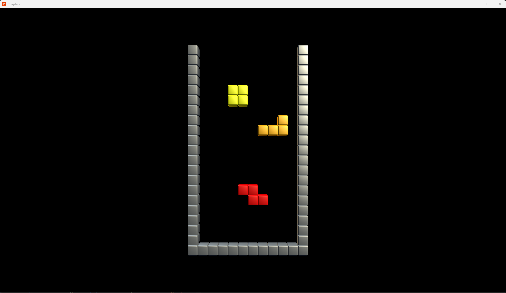
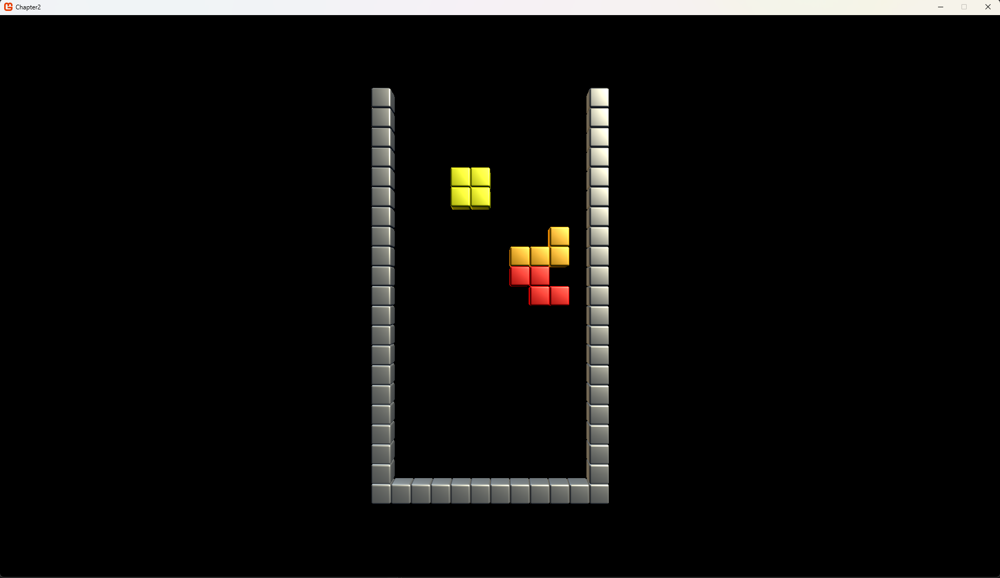

# The Grid
The grid is the playfield of the game. It has a couple of important functions:
* Check the player piece against the occupied cells.
* Fill cells when the player piece can no longer move downwards.
* Check for completed lines.
* Remove completed lines.

## Cells
The core of the grid is a cell. The cell tells us if that space is occupied or not. Additionally we want to keep record of what color the piece had that was dropped there. So our cell structure is quite simple:

```csharp
    internal struct Cell
    {
        public bool Occupied;
        public Color Color;
    }
```

Now it is time to construct the grid.

## The playfield
As mentioned before- the grid has a few tasks, but first we need to construct it.


```csharp
    internal class Playfield
    {
        private Cell[][] _cells;
        private const int COLUMNS = 10;
        private const int LINES = 20;

        private Vector3 _position;

        public Playfield(Vector3 position)
        {
            _position = position;

            _cells = new Cell[LINES][];

            for (int i = 0; i < LINES; i++)
            {
                _cells[i] = new Cell[COLUMNS];

                for (int j = 0; j < COLUMNS; j++)
                    _cells[i][j] = new Cell() { Occupied = false, Color=Color.Black }; 
                    // Color doesn't really matter as we're not going to draw unoccupied spaces.
            }
        }
    }
```

This initializes our playfield. I also added a `position` variable, so we can position the playfield in our game, once we start to visualize it. Keep in mind that the grid is structured `[lines][columns]` which may be counter intuitive as lines are on the y axis and columns on the x axis. The reason for this is that we are going to deal with lines later, so it is easier to have that as our primary index. If it is confusing now, you'll see later.

### Drawing the playfield
Drawing is quite simple, you will see that there isn't all that much of a difference if we were to construct this game in 2D- most of the code and calculations are quite similar! Let's have a look:

The playfield is made up out of cubes. Since we're going to draw a few of them, let's create a little helper function, we can use the `Asset.Models` class for this:
```csharp
    internal static class Models
    {

        //...

        public static void DrawCube(Matrix world, Color color)
        {
            foreach (ModelMesh m in CubeObject.Meshes)
            {
                foreach (ModelMeshPart part in m.MeshParts)
                {
                    part.Effect = GameRoot.BasicEffect;
                    GameRoot.BasicEffect.World = world;
                    GameRoot.BasicEffect.DiffuseColor = color.ToVector3();
                }
                m.Draw();
            }
        }
    }
```

Now we can draw a bunch of cubes to show the grid. Note how the calculation is based on simple x and y grid of 0.2f units per cube. Also note how there are 2 translations added: the individual cube position and the position of the grid itself as defined by th `_position` variable. The top left of the actual playfield is at `_position`, the border extends one cube outwards (therefore the cubes on the left side border are at `x= -1 * 0.2f`, meaning *one cube left of `_position.X`):

```csharp
        public void Draw()
        {
            for (int y = 0; y < LINES; y++)
            {
                //left border:
                Assets.Models.DrawCube(
                    Matrix.CreateTranslation(_position) * Matrix.CreateTranslation(-1 * 0.2f, -y * 0.2f, 0), 
                    Color.Gray);

                //right border:
                Assets.Models.DrawCube(
                    Matrix.CreateTranslation(_position) * Matrix.CreateTranslation(COLUMNS * 0.2f, -y * 0.2f, 0), 
                    Color.Gray);

                //cells in this line:
                for (int x = 0; x < COLUMNS; x++)
                {
                    //if the cell is empty, skip to the next one.
                    if (!_cells[y][x].Occupied)
                        continue;

                        Assets.Models.DrawCube(
                            Matrix.CreateTranslation(_position) * Matrix.CreateTranslation(x * 0.2f, -y * 0.2f, 0), 
                            _cells[y][x].Color);
                }
            }

            //Draw bottom of the grid
            for (int x = -1; x < COLUMNS+1; x++)
            {
                Assets.Models.DrawCube(Matrix.CreateTranslation(_position) * Matrix.CreateTranslation(x * 0.2f, -20 * 0.2f, 0), 
                Color.Gray);
            }
        }
```
## Place a tetrimono in the grid
Tetiminoes that are 'locked in' are creating occupied spaces in the grid. We are keeping the active player piece separate from the locked in pieces- the active player piece is _not_ part of the grid, only fixed pieces are. In fact these locked in pieces can be broken up if a line forms. So we copy the cells of the tetrimino into the grid:
The leftcolumn and the topline are the top left corner of the piece.

```csharp
        public bool LockInPlace(Tetrimino.Tetrimino shape, int leftcolumn, int topline)
        {
            //if the piece is outside the array of the grid: it cannot be placed!
            if (topline < 0)
                return false;

            for (int y = 0; y < shape.CurrentShape.shapeBit.Length; y++)
            {
                for (int x = 0; x < shape.CurrentShape.shapeBit[y].Length; x++)
                {
                    if (shape.CurrentShape.shapeBit[y][x])
                    {
                        _cells[topline + y][leftcolumn + x].Occupied = true;
                        
                        _cells[topline + y][leftcolumn + x].Color = shape.Color;
                    }
                }
            }
            return true;
        }
```

## Putting it together!
Time to see the results! Let's make a quick test to show a few pieces in a grid! So let's start with our `Gameplay` class! We're going to generate 3 Tetriminoes and lock them into a few arbitraty chose places!

```csharp
    internal class GameScene : IScene
    {

        private Grid.Playfield _playfield;

        public GameScene()
        {
            // The playfield's origin is topleft:
            // The playfield is 2 units wide and 4 units high; so -1,2,0 puts the playfield in the center of our view. 
            _playfield = new Grid.Playfield(new Vector3(-1f,2f,0));

            //let's generate a tetrimino:
            TetriminoFactory factory = new TetriminoFactory();

            Tetrimino.Tetrimino t1 = factory.Generate(Enums.Tetriminoes.O);
            Tetrimino.Tetrimino t2 = factory.Generate(Enums.Tetriminoes.L);
            Tetrimino.Tetrimino t3 = factory.Generate(Enums.Tetriminoes.Z);

            _playfield.LockInPlace(t1, 3, 4);
            _playfield.LockInPlace(t2, 6, 7);
            _playfield.LockInPlace(t3, 4, 14);
        }

        public void Update(GameTime gameTime)
        {
        }

        public void Draw(SpriteBatch spriteBatch, GameTime gameTime)
        {
            _playfield.Draw();
        }

    }
```

Make sure you push this new scene in the scene manager in the `GameRoot` in the `ContentLoad()` method. If you run the code you should be greeted by this:



## Check the player's piece against the grid
An important task is to actually know if the piece the player controls can go where the player wants it to go. Since the player's shape is defined by a set of booleans and our grid `IsOccupied` variable is a boolean; checking is really simple! I have added comments in the code for each check. We can simply return out of these loops, as soon as only 1 check fails, the entire shape cannot fit in the designated area!

```csharp
        public bool DoesShapeFitHere(Tetrimino shape, int leftcolumn, int topline)
        {
            //loop over the bits in our shape:
            for (int y = 0; y < shape.CurrentShape.shapeBit.Length; y++)
            {
                for (int x = 0; x < shape.CurrentShape.shapeBit[y].Length; x++)
                {
                    //We only need to check bits that are set to true
                    if (shape.CurrentShape.shapeBit[y][x])
                    {
                        //so this is a filled bit of the shape!

                        //we return false if the shape tries to fit in the border:
                        //check for bottom:
                        if (topline + y >= LINES)
                            return false;

                        //check for left wall:
                        if (leftcolumn + x < 0)
                            return false;

                        //check for right wall:
                        if (leftcolumn + x >= COLUMNS)
                            return false;

                        //We're not checking the top- a piece spawns above the playfield!
                        //bonus, we prevent the array out of bounds
                        if (topline + y < 0)
                            continue;

                        //now for the grid:
                        //if both the bit in the shape is true
                        //and the cell is occupied, 
                        //the shape can not fit!
                        if (_cells[topline+y][leftcolumn+x].Occupied)
                            return false;
                    }
                }
            }

            //all checks came out clear, so it fits!
            return true;
        }
```

### Testing the code
Replace the lines in the `GameScene` class so instead of locking t3 directly into place, we're adding 3 attempts:
```csharp
            _playfield.LockInPlace(t1, 3, 4);
            _playfield.LockInPlace(t2, 6, 7);

            if(_playfield.DoesShapeFitHere(t3, 3, 4)) // 3,4 is occupied by t1
                _playfield.LockInPlace(t3, 3, 4);

            if (_playfield.DoesShapeFitHere(t3, 6, 7)) // 6,7 occupied by t2
                _playfield.LockInPlace(t3, 6, 7);

            if (_playfield.DoesShapeFitHere(t3, 6, 9)) // is free!
                _playfield.LockInPlace(t3, 6, 9);
```
The result should be that only the final `6, 9` coordinates are valid; so only that piece should be visible when running the code, like so:


## Checking for completed lines
Checking the lines is a simple task. We check each line and see if all cells are occupied. In this code we're only checking _if_ any lines are found, and return the total number of found lines. We're going to keep track of the completed lines so we can remove them later.
The main reason not to immediate remove the lines, is so a nice "line clear" effect can be created. The player migh need to wait for that effect to complete.

```csharp
        private List<int> CompletedLines = new List<int>();

        public int ValidateField()
        {
            CompletedLines.Clear();

            for (int y = 0; y < LINES; y++)
            {
                bool lineclear = true;
                for (int x = 0; x < COLUMNS; x++)
                {
                    if (!_cells[y][x].Occupied)
                    {
                        //unoccupied space in this line, no need to check further.
                        lineclear = false;
                        break;
                    }
                }

                if (lineclear)
                {
                    CompletedLines.Add(y);    
                }
            }

            return CompletedLines.Count;
        }
```

So while we have detected the lines, let's add the method to clean up those lines. I have broken up the process in three steps:

```csharp
        public void ClearLines()
        {
            foreach(int line in CompletedLines)
                ClearLine(line);
        }

        private void ClearLine(int y)
        {
            for (int line = y; line > 0; line--)
            {
                _cells[line] = CopyLine(line - 1);
            }

            for (int column = 0; column < COLUMNS; column++)
            {
                Cell c = new Cell() { Occupied = false, Color = Color.Transparent };
                _cells[0][column] = c;
            }
        }

        private Cell[] CopyLine(int line)
        {
            Cell[] cells = new Cell[COLUMNS];
            for (int column = 0; column < COLUMNS; column++)
            {
                Cell c = new Cell() { Occupied = _cells[line][column].Occupied, Color = _cells[line][column].Color };
                cells[column] = c;
            }
            return cells;
        }
```

## Test clearing those lines!
Right, let's complete this section by showing that it works!

First change the code in `GameScene` so we have a completed line in our grid:
```csharp
            Tetrimino.Tetrimino t1 = factory.Generate(Enums.Tetriminoes.O);
            Tetrimino.Tetrimino t2 = factory.Generate(Enums.Tetriminoes.L);
            Tetrimino.Tetrimino t3 = factory.Generate(Enums.Tetriminoes.J);
            Tetrimino.Tetrimino t4 = factory.Generate(Enums.Tetriminoes.O);

            _playfield.LockInPlace(t1, 0, 18);
            _playfield.LockInPlace(t2, 2, 18);
            _playfield.LockInPlace(t3, 5, 18);
            _playfield.LockInPlace(t4, 8, 18);
```
Run the code, and you should see a bunch of tetriminoes occupy the bottom row.
Now let's check the lines and clear them, add this right below the previous code:
```csharp
            int lines = _playfield.ValidateField();
            _playfield.ClearLines();
```

This concludes all we need from the grid!