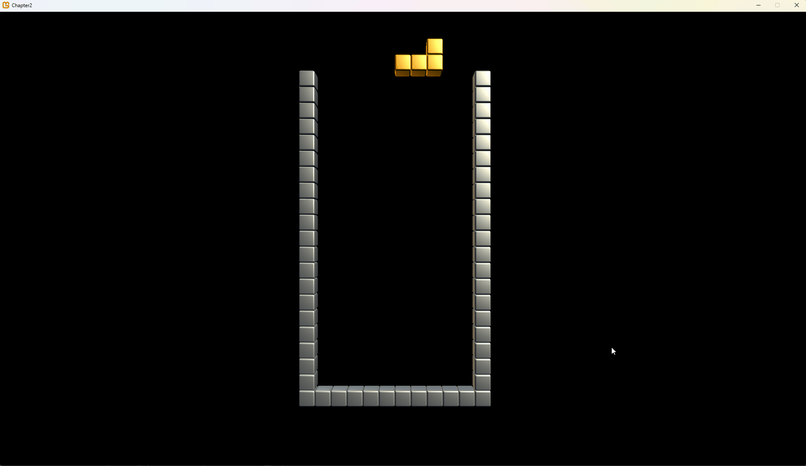
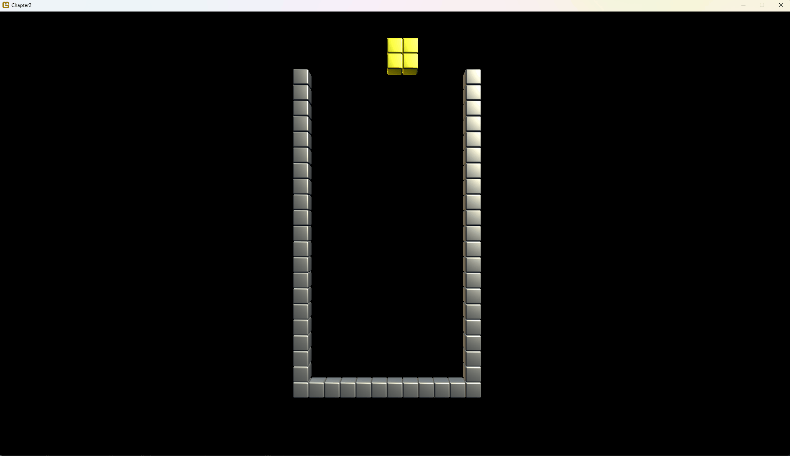
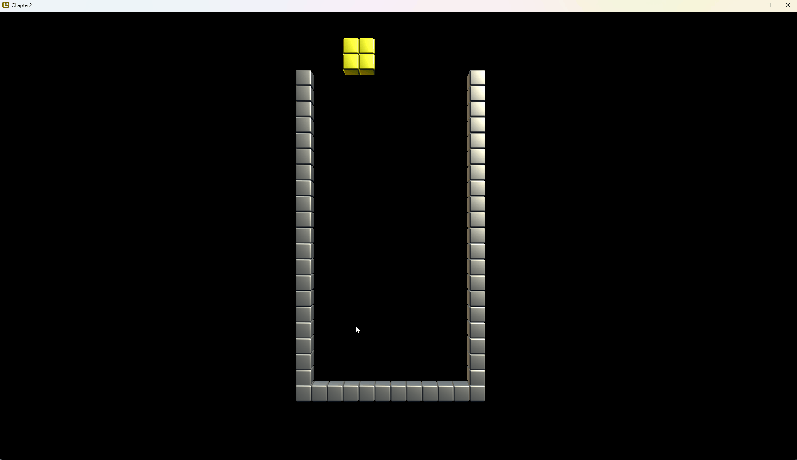
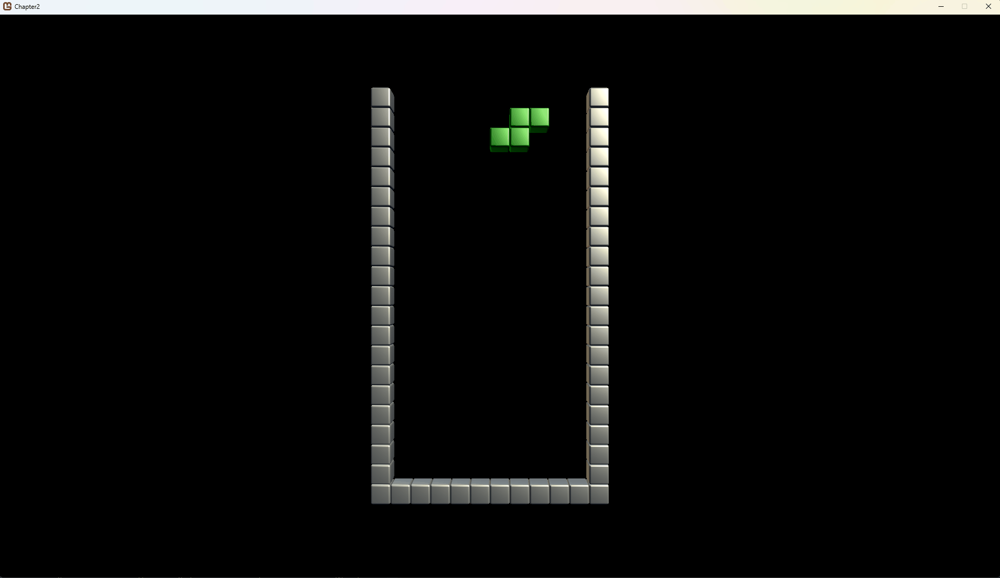

# Moving pieces
In our previous section we have all components made to start our basic game.

So let's give the player control and play the game!

## Handling input
In our example game, the player will interact using the keyboard. To keep things simple, while at the same time give room to improve, the input will be handles by a separate class. This paves the way for further customisation in the input, adding gamepad or user defined control schemes without having to change the gameplay logic.
There are many ways to do this, so adapt to suit your needs.

```csharp
internal class InputManager
{
    private KeyboardState _oldState, _newState;

    public enum Controls
    {
        Left,
        Right,
        SoftDrop,
        HardDrop,
        RotateCW,
        RotateCCW
    }

    Dictionary<Controls, Keys> Controlscheme;

    public InputManager()
    {
        //initialize these states.
        _newState = Keyboard.GetState();
        _oldState = _newState;

        //define the controlscheme for our game:
        Controlscheme = new Dictionary<Controls,Keys>();

        Controlscheme.Add(Controls.Left, Keys.Left);
        Controlscheme.Add(Controls.Right, Keys.Right);
        Controlscheme.Add(Controls.SoftDrop, Keys.Down);
        Controlscheme.Add(Controls.HardDrop, Keys.Up);
        Controlscheme.Add(Controls.RotateCW, Keys.LeftControl);
        Controlscheme.Add(Controls.RotateCCW,Keys.LeftShift);

    }

    public void Update()
    {
        _oldState = _newState;
        _newState=Keyboard.GetState();
    }

    public bool IsPressed(Controls key)
    {
        if(!Controlscheme.ContainsKey(key))
            throw new Exception("Control key does not exist.");

        Keys k = Controlscheme[key];
        return _oldState.IsKeyUp(k)&&_newState.IsKeyDown(k); 
    }

    public bool IsDown(Controls key)
    {
        if(!Controlscheme.ContainsKey(key))
            throw new Exception("Control key does not exist.");

        Keys k = Controlscheme[key];
        return _newState.IsKeyDown(k); 
    }

    public bool IsReleased(Controls key)
    {
        if(!Controlscheme.ContainsKey(key))
            throw new Exception("Control key does not exist.");

        Keys k = Controlscheme[key];
        return _oldState.IsKeyDown(k)&&_newState.IsKeyUp(k);
    }
}
```

In many games, the behavior of key presses depends on whether a key was just pressed, is being continuously held, or was just released. To handle this, we update the current `KeyboardState` every frame and retain the previous frame's state. By comparing these two states, we can determine the exact timing of key actions, such as whether a key was just pressed.

Additionally, using a dictionary to map game controls to specific keys decouples the game logic from hardcoded key bindings. While the constructor currently assigns hardcoded values, this can easily be replaced with values from a configuration file, allowing dynamic updates to key mappings during runtime.

Finally, this approach can be expanded to support other input devices, such as gamepads. By implementing similar logic for gamepad states, input handling remains unified and game logic does not need to change, making it straightforward to support multiple input methods.

### One more thing!
The [Tetrimino factory](2-1-Tetriminos.md) should generate pieces at random[^1]. We could assign a `seed` to the factory so it generates the same sequence every time- useful if you want to expand this game to a versus battle where both players should have equal opportunities. For now we simply add a randomizer to generate a random piece. So in our `TetriminoFactory` class:

```csharp
    private Random _random=new Random();

    public Tetrimino GenerateRandom()
    {
        return Generate((Tetriminoes)_random.Next(7)); // pick one of 7 possible pieces.
    }
```

[^1]:There is a specific algorithm in Tetris for random pieces, which is another topic later. For now, we stick with the simple random function. After a few plays with the 'puser' random function, you will understand why!

## The Player
Finally we have arrived at the player! What does the player object control? 
* The current dropping piece
* It's reference to the playing field on which the player is playing
* Getting the next piece
* Keeping track of the player score and level

There are many subtle mechanics in Tetris, but right now it is time to focus on the basics.

```csharp
internal class Player
{
    private Grid.Playfield _playfield;
    private Tetrimino.TetriminoFactory _pieceFactory;

    private InputManager _playerInput;

    private Tetrimino.Tetrimino _currentPiece; // the piece under player control
    private int _x,_y; // position of the current piece

    public Player(Grid.Playfield playfield)
    {
        _playfield = playfield; // assign a playfield to the player.
        _pieceFactory = new Tetrimino.TetriminoFactory(); // a way to generate new pieces.

        _playerInput = new InputManager();

        GeneratePiece(); // Give the player a piece to start with.
    }

    private void GeneratePiece()
    {
        _currentPiece = _pieceFactory.GenerateRandom();
        _x=5;
        _y=-2; //yes, the piece actually starts above the playfield.
    }
}
```
As you can see, the player is initialized with a playfield. The reason this is done is because if the gamemode is a 2 player version, the actual game screen is the one that determines where this player's game is shown. Since we want to contain the logic of the Tetris game as much as possible in one place, the `Player` class handles most of the gameplay logic. 

```csharp
    public void Draw()
    {
        _playfield.Draw();
    }
```

But wait- the player object has no clue where the playfield is in the 3D world- This is the responsibility of the playfield; so let's add a draw function to the playfield to draw a piece at the game coordinates (row, column) in the right place in the 3D world.

In the `Playfield` class:
```csharp
    public void DrawTetrimino(Tetrimino.Tetrimino t, int column, int row)
    {
        Matrix world = Matrix.CreateTranslation(_position) * 
                    Matrix.CreateTranslation(column * 0.2f, -row * 0.2f, 0);

        t.Draw(world); 
    }
```

Now we can complete the `Draw()` method in the `Player` class:

```csharp
    public void Draw()
    {
        _playfield.Draw();
        _playfield.DrawTetrimino(_currentPiece, _x, _y);
    }
```

Let's add the `Update()` method in the `Player` class to execute our gameplay logic.

```csharp
    public void Update(GameTime gameTime)
    {
        // update the state of playerinput.
        _playerInput.Update();

        // don't worry, gameplay logic will be added!
    }
```

## The scene
Okay, we now have almost everything to start our gameplay. For completeness we're going to introduce the `Marathon` scene- Marathon is the default gameplay of Tetris where a player tries to score as many points and keep the game going for as long as possible.

This class will hold the player object and keep track of the win or lose conditions. This way we can introduce *sprint*, *ultra* and *versus* gamemodes.[^2]

[^2]: *Sprint* is a complete a set number of lines as fast as possible, *ultra* is score as many points in a set timelimit, *versus* is a competitive mode where scoring lines gives the opponent so called 'garbage' lines.

```csharp
internal class MarathonGame : IScene
    {

        private Player _player;
        private Playfield _playfield;

        public MarathonGame() 
        { 
            // The playfield's origin is topleft:
            // The playfield is 2 units wide and 4 units high; so -1,2,0 puts the playfield in the center of our view. 
            _playfield = new Playfield(new Vector3(-1f,2f,0));

            // Create a player and assing the playfield object:
            _player=new Player(_playfield);
        }

        public void Update(GameTime gameTime)
        {
            _player.Update(gameTime);
        }


        public void Draw(SpriteBatch spriteBatch, GameTime gameTime)
        {
            _player.Draw();
        }
    }
```
Now if we change the lines in `GameRoot` to push a `MarathonGame` instead of the previous test scene, we should be greeted with a playfield, ready for the player!

## Move the piece
Now we can see the results of our work, time to make things move.
The basic movement logic is: does the shape fit in the intended location? If so allow the move otherwise, well don't. So let's start with the simple, left and right movements:

In the `Player.Update()`, after we updated the input manager:
```csharp
    if(_playerInput.IsPressed(Controls.Left))
    {
        if(_playfield.DoesShapeFitHere(_currentPiece, _x-1, _y))
        {
            _x-=1;
        }
    }

    if(_playerInput.IsPressed(Controls.Right))
    {
        if(_playfield.DoesShapeFitHere(_currentPiece, _x+1, _y))
        {
            _x+=1;
        }
    }
```
Rotation is slightly different, we rotate the piece: test if it fits, if it doesn't we rotate it back:
```csharp
    if(_playerInput.IsPressed(Controls.RotateCW))
    {
        _currentPiece.RotateLeft();
        if(!_playfield.DoesShapeFitHere(_currentPiece, _x, _y))
        {
            // it does not fit! Rotate it back:
            _currentPiece.RotateRight();
        }
    }

    if(_playerInput.IsPressed(Controls.RotateCCW))
    {
        _currentPiece.RotateRight();
        if(!_playfield.DoesShapeFitHere(_currentPiece, _x, _y))
        {
            // it does not fit! Rotate it back:
            _currentPiece.RotateLeft();
        }
    }
``` 
Now, run the code and you should be able to move the (random) piece left to right and rotate it!



The softdrop and harddrop are bit different, first the soft drop:

```csharp
public void Update(GameTime gameTime)
{
    // ...

    if(_playerInput.IsPressed(Controls.SoftDrop))
    {
        if(_playfield.DoesShapeFitHere(_currentPiece, _x, _y+1))
        {
            // There is room:
            _y+=1;
        }
        else
        {
            // There is no room! So the down movement triggered the lock.
            SoftlockPiece();
        }
    }
}

private void SoftlockPiece()
{
    // lock the piece onto the playfield:
    _playfield.LockInPlace(_currentPiece, _x, _y);

    // line checking will be done later!

    // give the player a new piece:
    GeneratePiece();
}
```
Keep in mind, there is more to moving the piece downwards so we're going to change this code soon. For now, this should give you the option to stack tetriminoes.



Onwards to the hard drop. The hard drop is a shortcut where the piece instantly moves to the lowest possible position. In Tetris there is a concept called the *ghost piece*[^3]. This a preview where the tetrimino would land given if it were to drop. We achieve two aims at once: calculate where we would visualize the ghost piece and determine the hard drop location of a piece.

[^3]: There are many acronyms in Tetris, the ghost piece is also called the TLS, short for *T*emporary *L*anding *S*ystem. However ghost or shadow piece is a more common term.

```csharp
private int _ghostX, _ghostY;

public void Update(GameTime gameTime)
{
    // ...

    // before we have the player move the piece, calculate the ghost piece location:
    CalculateGhostPiece();

    // ...

    if(_playerInput.IsPressed(Controls.HardDrop))
    {
        HardDrop();
    }
}

private void CalculateGhostPiece()
{
    // to see where the piece lands, just keep moving down until we no longer can:
    _ghostX=_x;
    _ghostY=_y;

    while(_playfield.DoesShapeFitHere(_currentPiece,_ghostX,_ghostY+1))
    {
        _ghostY++;
    }
}

private void HardDrop()
{
    // lock the piece onto the playfield:
    _playfield.LockInPlace(_currentPiece, _ghostX, _ghostY);

    // line checking will be done later!

    // give the player a new piece:
    GeneratePiece();
}
```

Now, the player controls for a basic game is complete! Don't worry- we'll get to the line clearing soon! Run the code to see the result:



## Drop and Gravity
In Tetris the concept of a piece dropping automatically is called drop which is expressed in *gravity*. The drop speed increases for each level. Lucky for us, Tetris is well documented and the calculation is known. The formula is for the time the terimino spends per row is as follows:

Time = (0.8-((Level-1)*0.007))<sup>(Level-1)</sup>


We want to know when to drop the piece automatically in `double`- because the `GameTime` returns values in doubles. Implementing this in our `Player` class:
```csharp
    private double CalculateDropSpeed(int level)
    {
        // formula as found on The Tetris Guidelines.
        // 1 is the first (lowest) level,
        // The dropspeed does not increase above 20.
        level = MathHelper.Clamp(level,1,20);

        // (0.8-((Level-1)*0.007))^(Level-1)
        return Math.Pow((0.8d - (level - 1) * 0.007d), (level - 1));
    }
```

In the next code section we're going to implement automatic drop: 
```csharp
    public int Level=1;
    private double _dropSpeed, _dropTimer;

    public Player(Grid.Playfield playfield)
    {
        // ...

        _dropSpeed = CalculateDropSpeed(Level); // what is the timing for the current level?
        _dropTimer = _dropSpeed; // to keep track of the timer for the current row. 

        // ...
    }

    public void Update(GameTime gameTime)
    {
        //[this line at the top of the update loop]
        _dropTimer -= gameTime.ElapsedGameTime.TotalSeconds;

        // ...

        //[this section at the bottom of the update loop]
        if(_dropTimer<0)
        {
            // time for this row is over, can we drop the piece?
            if(_playfield.DoesShapeFitHere(_currentPiece,_x,_y+1))
            {
                // yes
                _y++;
            }
            else
            {
                // no- lock the piece:
                SoftlockPiece();
            }

            //reset the timer:
            _dropTimer+=_dropSpeed;
        }

        // ...
    }
```
When you run the code now, the tetrimino automatically drops! Increase the variable `Level` to see the speed difference. Higher speeds require special techniques to play[^4], which is a topic for the next chapter!
[^4] Tetris is a rabbithole of gameplay details, soon you'll learn about *ARR*, *DAS*, *SRS* and experience the [Tetris Effect](https://en.wikipedia.org/wiki/Tetris_effect)!

The final bit to tweak is the softdrop by the player. In the current implementation the player needs to repeatedly press the down key to make the piece drop. The intended gameplay is trigger this by keeping the key pressed. What actually happens is the down key *increases* the timer for the current row by a factor. In a lot of Tetris implementations this factor is 6, meaning pressing the softdrop key speeds the timer up six times. This is called the SDF (did I mention Tetrisfans love 3 letter acronyms?).
```csharp
private const int SDF = 6; //Soft Drop Factor
```

A revised version of the softdrop code in the `Update()` loop looks like this:
```csharp
    if(_playerInput.IsDown(Controls.SoftDrop))
    {
        _dropTimer -= (SDF * _dropSpeed) * gameTime.ElapsedGameTime.TotalSeconds;
    }
```
Notice that `IsPressed` is replaced by `IsDown`! The whole locking logic is replaced because it is handled by the autodrop.

If you run the game, you should be able to stack pieces! We haven't implemented the game over state yet, but we'll get to that soon!



In the next tutorial line checking and game states will be added!