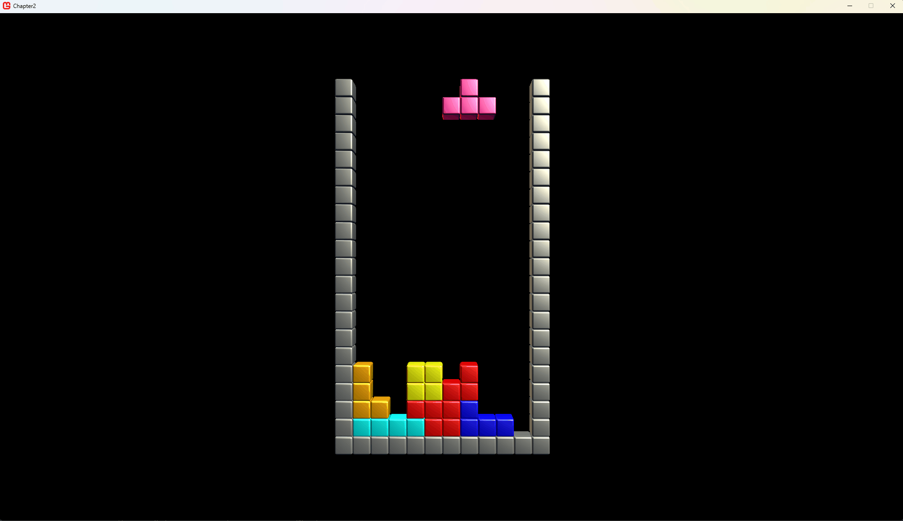
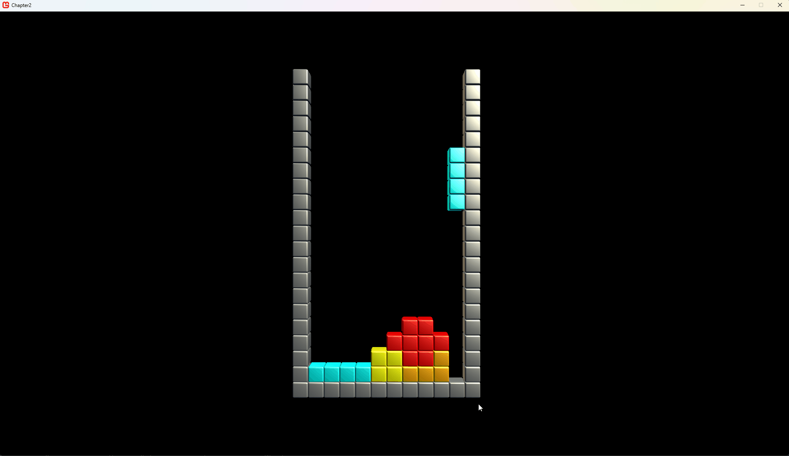

# Checking lines
Or better: playing the actual game. 

In the previous section we managed to get the basic gameplay going. The only thing left is to clear lines. In the playfield- this logic already exists, so it is easy to implement:

In both the `Harddrop()`, `SoftlockPiece()` methods in the `Player` class, implement the line clear check:
```csharp
    if (_playfield.ValidateField() > 0)
    {
        _playfield.ClearLines();
    }
```

Nice! The game is now playable. Ofcourse the scoring and increment of the level needs to be added- but if you got this far: great enjoy a little round of Tetris!

## The next stage

The game is playable, but lacks a bit of [juice](https://www.youtube.com/watch?v=Fy0aCDmgnxg). Also, this is a step up to get our *marathon* gameplay to work. So let's get started!

### The clear effect

The effect we're going to create is a nice line highlight effect before the lines disappear. We're going to need some variables:

```csharp
    private double _lineClearTimer; // keep track of the highligh duration
    private const double HIGHLIGHTTIME=1; // the actual duration of the highlight effect
```

Next the playfield needs an update function to actually keep track of this highlight timer, and the updated `Draw` method that includes the highlight:

```csharp
    public void Update(GameTime gameTime)
    {
        if (_lineClearTimer > 0)
        {
            _lineClearTimer -= gameTime.ElapsedGameTime.TotalSeconds;

            if (_lineClearTimer < 0)
            {
                // clear the completed lines
                ClearLines();
            }
        }
    }

    public void Draw()
    {
        for (int y = 0; y < LINES; y++)
        {
            //left border:
            Assets.Models.DrawCube(
                Matrix.CreateTranslation(_position) * Matrix.CreateTranslation(-1 * 0.2f, -y * 0.2f, 0),
                Color.Gray);

            //right border:
            Assets.Models.DrawCube(
                Matrix.CreateTranslation(_position) * Matrix.CreateTranslation(COLUMNS * 0.2f, -y * 0.2f, 0),
                Color.Gray);

            //cells in this line:
            for (int x = 0; x < COLUMNS; x++)
            {
                //if the cell is empty, skip to the next one.
                if (!_cells[y][x].Occupied)
                    continue;

                if (_lineClearTimer > 0)
                {
                    if (CompletedLines.Contains(y))
                    {
                        Assets.Models.DrawCube(
                            Matrix.CreateTranslation(_position) * Matrix.CreateTranslation(x * 0.2f, -y * 0.2f, 0),
                            Color.White * (float)(_lineClearTimer/HIGHLIGHTTIME));

                        // this cube is hilighted and we can carry onto the next cube.
                        continue;
                    }
                }

                Assets.Models.DrawCube(
                    Matrix.CreateTranslation(_position) * Matrix.CreateTranslation(x * 0.2f, -y * 0.2f, 0),
                    _cells[y][x].Color);
            }
        }    
```
Finally in the `Playfield` class the timer needs to be set:

```csharp
        public int ValidateField()
        {
            CompletedLines.Clear();

            for (int y = 0; y < LINES; y++)
            {
                bool lineclear = true;
                for (int x = 0; x < COLUMNS; x++)
                {
                    if (!_cells[y][x].Occupied)
                    {
                        //unoccupied space in this line, no need to check further.
                        lineclear = false;
                        break;
                    }
                }

                if (lineclear)
                {
                    CompletedLines.Add(y);
                }
            }

            // Set the highlight timer!
            if (CompletedLines.Count > 0)
            {
                _lineClearTimer = HIGHLIGHTTIME;
            }

            return CompletedLines.Count;
        }
```

These changes created the following: when the field is validated and any completed lines are found, these lines are stored and the highlight timer is set. Every frameupdate the timer is decreased until zero- once it reaches zero; the lines are cleared. If there are any completed lines in the `CompletedLines` list these will be highlighed in `Color.White` multiplied by the time left on the counter (in percentage) as a nice fade effect.

A couple things are needed to trigger this, first the `Player` class must update the playfield:
```csharp
    public void Update(GameTime gameTime)
    {
        // update the state of playerinput.
        _playerInput.Update();

        // update the playfield
        _playfield.Update(gameTime);

        // ...
    }
```

In the `HardDrop` and `SoftlockPiece()` methods comment the line that actually clears the lines, this will be replaced with something else soon.

```csharp
    if (_playfield.ValidateField() > 0)
    {
        //_playfield.ClearLines();
    }
```

When running the code the game can be played and the lines are highlighted and fade nicely.



There is a problem- the game continues while the lines are highlighted. In a Tetris game- the playing field should be static while the player is moving the piece. 

## Game events

The game is split into four components:
1. **The Marathon scene**: this is the "game mode" it controls the win and lose conditions, in this case: When the player is topped out, the player has lost.
2. **The Playfield object**: The representation of the game in our scene. It knows what cells are occupied, if a piece fits and what lines are completed.
3. **The Player object**: This is where the user interacts with the playfield.
4. **The Tetrimino**: the active player piece that the player can manipulate.

Until now, the components in our game interact directly by calling *methods*. In this section, we're introducing a new concept: *events*. Events allow us to set things up so components can respond to specific actions without needing to check constantly or call methods directly every frame.

See the scenario as we encountered above: the player completes a line. We want the playfield to highlight the completed line for a second and then remove it. During this second, gameplay is paused, and the player has to wait for the game to continue. How can we handle this? There are a few approaches we could take:

1. **Use a timer in the player class.** The player class could manage a timer to wait for one second before resuming gameplay. However, this ties the player logic to the playfield's behavior, which isn't ideal since the two should be separate.

2. **Check every frame.** The game could continuously check if a line is being highlighted and then act accordingly. While this works, it wastes processing time and makes the code harder to manage.

3. **Let the playfield notify the player.** The playfield can send a signal to the player once the highlighting is done. This keeps the playfield responsible for its own logic and allows the player to react only when needed.

This third option is where events shine. By using events, we can decouple the playfield and player logic. The playfield handles the highlighting and notifies interested components (like the player) when it's finished. This way, each component stays focused on its own responsibilities while still working together seamlessly.

In the next section, we'll explore how to implement this approach.

### The Lines Cleared Event
The playfield will tell any class that is interested that lines were cleared. A special class is introduced with event arguments. Add the class `LinesClearedEventArgs` like so:
```csharp
    public class LinesClearedEventArgs : EventArgs
    {
        public int NumberOfClearedLines;
    }
```
In the `Playfield` class, add the following code to enable us to raise the event:
```csharp
    public event EventHandler<LinesClearedEventArgs> LinesClearedCompleteEvent;

    protected virtual void RaiseClearedLinesCompleteEvent(LinesClearedEventArgs e)
    {
        EventHandler<LinesClearedEventArgs> handler = LinesClearedCompleteEvent;
        if (handler != null)
        {
            handler(this, e);
        }
    }
```

### Raising the event
If we now add this code to the `ClearLines()` method:
```csharp
    public void ClearLines()
    {
        foreach (int line in CompletedLines)
            ClearLine(line);

        // tell the interested objects that we've completed the line clearing sequence!
        RaiseClearedLinesCompleteEvent(new LinesClearedEventArgs() { NumberOfClearedLines = CompletedLines.Count });
    }
```

### Reacting to the raised event
Okay, we have everything in place to implement our mini pause in the gameplay. Here we go, all in the `Player` class:

```csharp
    private enum PlayerStates
    {
        Playing,                // the player is in control of the piece.
        WaitingForClearComplete // the player needs to wait for the playfield to clear the lines.
    }
    private PlayerStates _state;

    public Player(Grid.Playfield playfield)
    {
        _playfield = playfield; // assign a playfield to the player.
        _pieceFactory = new Tetrimino.TetriminoFactory(); // a way to generate new pieces.

        _dropSpeed = CalculateDropSpeed(Level); // what is the timing for the current level?
        _dropTimer = _dropSpeed; // to keep track of the timer for the current row. 

        _playerInput = new InputManager();

        GeneratePiece(); // Give the player a piece to start with.

        _state = PlayerStates.Playing; // At the moment the player can immediately play!

        _playfield.LinesClearedCompleteEvent += PlayfieldLinesClearedCompleteEvent; // subscribe to this event!
    }

    private void PlayfieldLinesClearedCompleteEvent(object sender, LinesClearedEventArgs e)
    {
        _state = PlayerStates.Playing; // the player can enjoy playing again!
    }
```

See the line `_playfield.LinesClearCompleteEvent += ...`? That's the line of code where we subscribe to the event. In Visual Studio, the code complete will show a small lightning bolt icon in the autocomplete dialog. In the above code, a few states are introduced. The player will start in the `Playing` state. When lines are completed, the game needs to switch states like so (remember above in the `HardDrop()` and `SoftlockPiece()`?)

```csharp
    if (_playfield.ValidateField() > 0)
    {
        _state = PlayerStates.WaitingForClearComplete;
    }
```

Almost there! A big change is incoming in the `Update()` method. A `switch` statement tells the code what to do in each state, finally the `Draw()` method should only draw the piece when the player can control it:

```csharp
    public void Update(GameTime gameTime)
    {
        // update the state of playerinput.
        _playerInput.Update();

        // update the playfield
        _playfield.Update(gameTime);

        switch (_state)
        {
            case PlayerStates.WaitingForClearComplete:
                {
                    // do nothing... just wait.
                    break;
                }

            case PlayerStates.Playing:
                {

                    // ...

                    // This section has al the player controls, automatic drops and so on.
                    // if unsure, check the code in the src/chaper2 solution!

                    // ...

                    break;
                }
        }
    }

    public void Draw()
    {
        _playfield.Draw();

        if (_state == PlayerStates.Playing)
        {
            _playfield.DrawTetrimino(_currentPiece, _x, _y);
        }
    }
```

There we go! The game now has better gameplay with a bit of *juice* added!



#### Continue
Next step: [Finishing Touches](2-5-FinishingTouches.md)