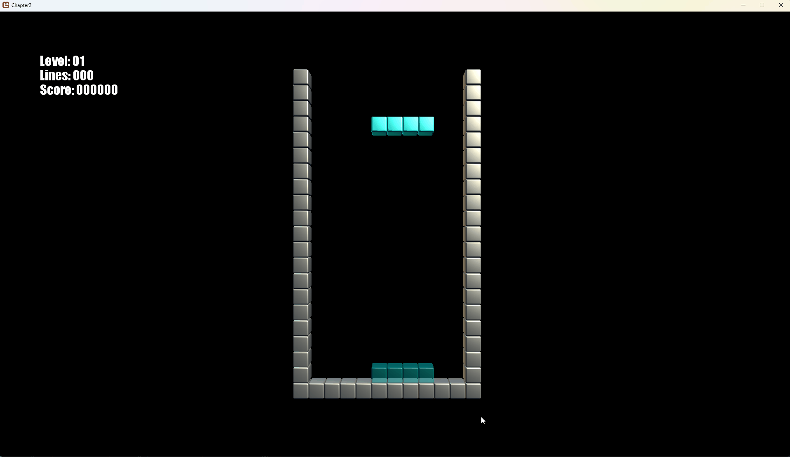

# Finishing Touches
We almost have a complete game of Tetris! Only a few things left to do...

## Increase the difficulty
At the moment, nothing is happening when lines are completed. Time to ramp up the challenge!

The level directly corresponds to the number of lines completed- that is, it cannot be lower than the number of lines divided by ten. I have also created a event for this, because a gameplay scene might want to know about this (for example, perhaps you want a gameplay mode to progress as quick as possible trough levels).

A class is added for the event arguments:
```csharp
    public class LinesClearedEventArgs : EventArgs
    {
        public int NumberOfClearedLines;
    }
```

The actual level check and event in the `Player` class:
```csharp
    public event EventHandler<LevelIncreasedEventArgs> LevelIncreasedEvent;

    // ...

    private void CheckLevel(int lines)
    {
        int lvl = (lines / 10) + 1; // there is no level 0, so we +1 for this.

        if (lvl <= Level)
            return; // we're at the same or higher level.

        // Level should increase!
        Level = lvl;

        // update settings that depend on the level:
        _dropSpeed = CalculateDropSpeed(Level); // what is the timing for the current level?
        _dropTimer = _dropSpeed; // set the starting value. 

        // notify others something interesting has happened:
        RaiseLevelIncreasedEvent(new LevelIncreasedEventArgs() { Level = lvl });
    }

    protected virtual void RaiseLevelIncreasedEvent(LevelIncreasedEventArgs e)
    {
        EventHandler<LevelIncreasedEventArgs> handler = LevelIncreasedEvent;
        if (handler != null)
        {
            handler(this, e);
        }
    }
```

When the player completes lines, we check if the difficulty must be raised:
```csharp
    public int Lines = 0; // To track the number of lines this player has completed

    private void PlayfieldLinesClearedCompleteEvent(object sender, LinesClearedEventArgs e)
    {
        _state = PlayerStates.Playing; // the player can enjoy playing again!

        // Lines were completed so increase the count and check if the difficulty must be increased:
        Lines += e.NumberOfClearedLines;
        CheckLevel(Lines);
    }
```

So why do we keep track of the level in the Player? Because if there are multiple players in a versus- each can be in their own difficulty (perhaps one player is ahead- or the other player is given a handicap to give a new gamer a better chance!)

If you run the game, the difficulty should increase automatically. The difficulty icreases slowly, so let's add an indicator to the game- so you can see what level you're in.

First- add a spritefont. I'm going to skip this part for this tutorial. The Monogame documentation on how to do it [is here](https://docs.monogame.net/articles/getting_to_know/howto/graphics/HowTo_Draw_Text.html), if you are unsure. Otherwise, have a look at the sourcecode in this repository. I try to keep my assets in a `static class` so it is easy retrievable everywhere. 

The `MarathonGame` class can be updated like so:
```csharp
    internal class MarathonGame : IScene
    {

        private Player _player;
        private Playfield _playfield;

        private int _level, _lines;

        public MarathonGame()
        {
            // The playfield's origin is topleft:
            // The playfield is 2 units wide and 4 units high; so -1,2,0 puts the playfield in the center of our view. 
            _playfield = new Playfield(new Vector3(-1f, 2f, 0));

            // Create a player and assing the playfield object:
            _player = new Player(_playfield);

            // Notify me when the level increases:
            _level = _player.Level;
            _lines = _player.Lines;

            // We're interested in these events, when does the level increase? 
            _player.LevelIncreasedEvent += PlayerLevelIncreasedEvent;
            // Does the player score lines?
            _playfield.LinesClearedCompleteEvent += PlayfieldLinesClearedCompleteEvent;
        }

        private void PlayfieldLinesClearedCompleteEvent(object sender, LinesClearedEventArgs e)
        {
            _lines += e.NumberOfClearedLines;
        }

        private void PlayerLevelIncreasedEvent(object sender, LevelIncreasedEventArgs e)
        {
            _level=e.Level;
        }

        public void Update(GameTime gameTime)
        {
            _player.Update(gameTime);
        }


        public void Draw(SpriteBatch spriteBatch, GameTime gameTime)
        {
            
            _player.Draw();

            spriteBatch.Begin();
            spriteBatch.DrawString(Art.GameFont,string.Format("Level: {0}", _level.ToString("00")), new Vector2(100,100),Color.White);
            spriteBatch.DrawString(Art.GameFont, string.Format("Lines: {0}", _lines.ToString("000")), new Vector2(100, 135), Color.White);
            spriteBatch.End();
        }
    }
```

Sidenote: the `spriteBatch` doesn't play nice with drawing 3D. So in the `GameRoot` update the Draw() like this:
```csharp
    protected override void Draw(GameTime gameTime)
    {
        GraphicsDevice.Clear(Color.Black);

        GraphicsDevice.BlendState = BlendState.Opaque;
        GraphicsDevice.DepthStencilState = DepthStencilState.Default;
        GraphicsDevice.RasterizerState = RasterizerState.CullCounterClockwise;

        SceneManager.Draw(_spriteBatch, gameTime);

        base.Draw(gameTime);
    }
```

Anyway, run the code and enjoy the increased difficulty!

## Score
Playing Tetris can be a zen-like experience, however it can still be a competitive game! Various game modes exist where the goal is to score as many points as possible.

Tetris scoring rules for the basic game is quite simple[^1]:
[^1]: There are bonus points for difficult manouvres such as T-spins, perfect clears and combos. Implementation of these is left as a excercise to the reader! ;-)

|Action|	Points|
|:------:|---------:|
|Single|	100 × level|
|Double|	300 × level|
|Triple|	500 × level|
|Tetris|	800 × level|
|Softdrop| 1 per cell|
|Harddrop| 2 per cell|

So let's add these rules, in the `PlayfieldLinesClearedCompleteEvent`:
```csharp
    private void PlayfieldLinesClearedCompleteEvent(object sender, LinesClearedEventArgs e)
    {
        _state = PlayerStates.Playing; // the player can enjoy playing again!

        // Score is based on what the level _was_ before the lines were added.
        switch (e.NumberOfClearedLines)
        {
            case 1:
                AwardScore(100 * Level);
                break;
            case 2:
                AwardScore(300 * Level);
                break;
            case 3:
                AwardScore(500 * Level);
                break;
            case 4:
                AwardScore(800 * Level);
                break;
        }

        // Lines were completed so increase the count and check if the difficulty must be increased:
        Lines += e.NumberOfClearedLines;

        CheckLevel(Lines);
    }
```

I added a separate (again event) for the scores in the `AwardScore()` method. This way a gameplay scene (like the `MarathonGame` class) can deal with the scores as well. Perhaps you want to have a character shout cool stuff if the player scores massive points. 
```csharp
    public event EventHandler<ScoreAwardedEventArgs> ScoreAwardedEvent;

    public void AwardScore(int value)
    {
        if(value==0) 
            return; //prevent unneeded events. (hhey perhaps negative score is possible in your game!)

        Score += value;

        RaiseScoreAwardedEvent(new ScoreAwardedEventArgs() { Score = Score, Increment=value });
    }

    protected virtual void RaiseScoreAwardedEvent(ScoreAwardedEventArgs e)
    {
        EventHandler<ScoreAwardedEventArgs> handler = ScoreAwardedEvent;
        if (handler != null)
        {
            handler(this, e);
        }
    }
```
The `ScoreAwardedEventArgs` class:
```csharp
    internal class ScoreAwardedEventArgs
    {
        public int Increment;
        public int Score;
    }
```
See if you can figure out how the hard and softdrop scores are awarded, and check the sourcecode of chapter 2 for the way I solved that.

## Game Over Man!
Once the top of the grid is reached... nothing happens. That can't be right!

The game is over if a piece cannot be placed. So let's add this to the `Player` class:

```csharp
    public void GameOver()
    {
        _state = PlayerStates.GameOver;
        RaiseGameOverEvent(new GameOverEventArgs() { Level = Level, Score = Score, Lines = Lines });
    }

    protected virtual void RaiseGameOverEvent(GameOverEventArgs e)
    {
        EventHandler<GameOverEventArgs> handler = GameOverEvent;
        if (handler != null)
        {
            handler(this, e);
        }
    }
```
We check the if the piece can be placed:

```csharp
    private void HardDrop()
    {
        // lock the piece onto the playfield:
        if (!_playfield.LockInPlace(_currentPiece, _ghostX, _ghostY))
        {
            GameOver();
        }

        // ..
    }

    private void SoftlockPiece()
    {
        // lock the piece onto the playfield:
        if (!_playfield.LockInPlace(_currentPiece, _x, _y))
        {
            GameOver();
        }

        // ..
    }
```

## The ghost piece
You probably have noticed that a misplaced drop can happen to anyone. It is easier to see where a piece ends up, if we would draw the ghost piece as well. Considering we have the `_ghostX` and `_ghostY` coordinates already, drawing the piece is trivial. Note that the `BasicEffect` has a parameter that sets the Alpha channel.
Set the `GraphicsDevice` in the `GameRoot` to:
```csharp
    GraphicsDevice.BlendState = BlendState.AlphaBlend;
```
Next add a `DrawGhostTetrimino` to the `Playfield` class where the alpha is controlled in the effect:
```csharp
    GameRoot.BasicEffect.Alpha = alpha;
```

If you put everything in this chapter together, you should be able to play the game like this!



Check the [sourcecode here](../src/Chapter2/).

If you are ready to dive into the rabbithole that is Tetris acronyms, I'll cover some details in the next chapter soon!


