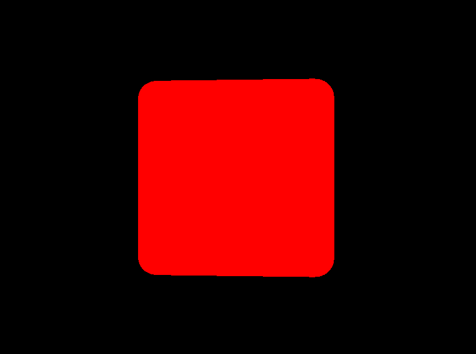

# Shaders
Shaders are small programs that run on the GPU to produce graphics. Without shaders, no graphics would be visible—even MonoGame’s 2D graphics rely on shaders (though that’s a topic for another time). A shader tells the GPU how to interpret and render data, effectively determining how objects appear on the screen. Monogame comes with a few shaders of its own, most notably the `BasicEffect`- which might suit for the most basic situations. Sometimes you want to do something unique or different- so read on if you'd like to know more!

When drawing a 3D model, you can assign your own effect, enabling the GPU to execute your custom shader code. This document will explain the basics of shader code, how it works, and how you can use it. Writing shaders can be challenging at first, but once you grasp the fundamentals, you’ll unlock countless opportunities to make your game stand out with unique visual effects!

In MonoGame, shaders are managed through the `ContentManager` as an `Effect`. To add a shader, use the Content Pipeline tool to include an effect file with the .fx suffix. If the code in the file is correct, the Content Builder will compile it into a format that can be loaded onto the GPU.

## Setting the stage
If you haven't already, check out the [3D basics article](1-2-ThreeDeeBasics.md) and the [Cube article](1-3-TheCube.md). The [Chapter 1 code](../src/) should provide you with a basic understanding of drawing a 3D object. Let's revise a few things so we can start using our own shader:

1. Add a `Effect` in the Content Pipeline Tool. Name it `MyEffect.fx`.


2. In the `GameRoot` class, let's add the shader so we can use it:
```csharp
    public static Effect MyEffect;

    protected override void LoadContent()
    {
        // ... put this line below the BasicEffect = new BasicEffect(GraphicsDevice);
        MyEffect = Content.Load<Effect>("MyEffect");

        //... put these lines below the line BasicEffect.Projection = Camera.Projection;
        MyEffect.Parameters["View"].SetValue(Camera.View);
        MyEffect.Parameters["Projection"].SetValue(Camera.Projection);
    }
```

3. Change the code in the `TitleScreen.Draw()` method:
```csharp
                foreach (ModelMeshPart part in m.MeshParts)
                {
                    // Assign the shader effect to this meshpart:
                    part.Effect = GameRoot.MyEffect;

                    // Position the object in the world: Move it to the coordinates (0,0,-3), rotate the object around the Y axis and increase the scale by 20:
                    GameRoot.MyEffect.Parameters["World"].SetValue(Matrix.CreateScale(20) * Matrix.CreateRotationY(_angle)*Matrix.CreateTranslation(0,0,-3f));

                    // Color this cube Red. Shaders don't "know" colors, so RGB is represented as a Vector3.
                    GameRoot.MyEffect.Parameters["DiffuseColor"].SetValue(Color.Red.ToVector3());
                }
```

Now the Monogame code is instructed to use the custom effect when drawing the cube. **However, there is still some work to do to actually make the shader work!** Let's dive into some theory on how shaders function.

## The Pipeline
Rendering computer graphics is often described as a series of steps in a pipeline, where each step performs a specific task in the process of transforming 3D data into a 2D image. Many of these steps are programmable, allowing for customization. The programs executed at these stages are collectively referred to as shaders.

The process works as follows: the *Vertex Shader* transforms the 3D vertices, positioning the 3D model in the correct location, scale, and orientation. Next, the *Rasterizer* determines, based on the transformed 3D data, which fragments (potential pixels) are affected. This information is passed to the *Pixel Shader*, which calculates the final color for each fragment. Finally, the fragment data is sent to the *Framebuffer*, which combines everything to produce the 2D image displayed on the screen. 
A fragment represents the smallest unit of a 2D image, analogous to a vertex, which is the smallest unit in a 3D model.

The two main programmable stages are the *Vertex Shader* and the *Pixel Shader*. Since these stages determine the final appearance of the model, we will focus on them.

## Shader Input
There are two main types of input in a shader. The most obvious type is the Vertex Buffer, which contains data such as positions, normals, and texture coordinates. This data is passed to the shader every time a draw call is made. The other type is Shader Parameters (called "uniforms"), which are values stored on the GPU that the shader can reference. These include data like 2D textures, transformation matrices, or vectors indicating the camera position.

Let's have a look at these:
```HLSL
matrix View;
matrix Projection;
matrix World;
float3 DiffuseLightDirection = float3(1, 0.75, 0.5);
float4 DiffuseColor = float4(1, 1, 1, 1);

struct VertexShaderInput
{
    float4 Position : POSITION0;
    float3 Normal : NORMAL0;
    float2 TexCoord : TEXCOORD0;
};
```
In this declaration section of the Vertex Shader, we define four uniforms (global variables accessible by the shader):

- Three matrices: `View`, `Projection` and `World`, which are used for transforming vertices in 3D space.
- A `float3` (a 3D vector in HLSL) called `DiffuseLightDirection`, representing the direction of a diffuse light source.
- A `float4` (a 4D vector in HLSL) called `DiffuseColor`, representing the color of the diffuse light.

Following this, we define a struct called `VertexShaderInput`, which describes the layout of the data the Vertex Shader expects from the Vertex Buffer. Each vertex has the following *attributes*:

- `Position` is a `float4` (x, y, z, w) labeled with the semantic `POSITION0`.
- `Normal` is a `float3` (x, y, z) labeled with the semantic `NORMAL0`.
- `TexCoord` is a `float2` (u, v) labeled with the semantic `TEXCOORD0`.
This declaration ensures that the Vertex Shader knows how to interpret the incoming data for processing.

The example Cube object, has these 3 datapoints for each vertex, which means that it corresponds to what the shader can expect. The *uniforms* are set in our code like this:
```csharp
 myEffect.Parameters["View"].SetValue(ViewMatrix);
```
Once set, an uniform retains its value. That way we can set up some shader values once for relatively static things (`Projection` for example) or frequent -multiple times per frame for each object (`World` for example).

## The Vertex Shader
Now that we've explored how the shader receives its inputs, let's dive into some actual Vertex Shader code:

```HLSL
struct VertexShaderOutput
{
    float4 Position : SV_POSITION;
    float3 Normal : NORMAL0;
    float3 WorldNormal : NORMAL1;
    float2 TexCoord : TEXCOORD0;
};

VertexShaderOutput MainVS(VertexShaderInput input)
{
    VertexShaderOutput output;

    // Transform the position using the matrices
    float4 worldPosition = mul(input.Position, World);
    float4 viewPosition = mul(worldPosition, View);
    output.Position = mul(viewPosition, Projection);

    // Copy the normal and texture coordinates
    output.Normal = input.Normal;
    output.TexCoord = input.TexCoord;

    // Calculate the world normal
    output.WorldNormal = normalize(mul(input.Normal, (float3x3) World));

	return output;
}
```

In this code:

1. **Output Structure**: The `VertexShaderOutput` structure defines the data that will be passed to the Rasterizer. This data is interpolated across the primitive's surface and made available for further processing in the Pixel Shader. It includes:

   - `Position` (with the semantic `SV_POSITION`), which represents the vertex's final screen-space position.
   - `Normal` (semantic `NORMAL0`), a copy of the vertex's original normal.
   - `WorldNormal` (semantic `NORMAL1`), the transformed normal in world space.
   - `TexCoord` (semantic `TEXCOORD0`), the vertex's texture coordinates.

2. **Vertex Shader Function**: The function `MainVS` processes the input data and transforms it using the provided uniform matrices (`View`, `Projection`, and `World`):

   - The vertex's position is transformed from model space to world space, then to view space, and finally to clip space, using the `mul` (matrix multiplication) function.
   - The normal vector is transformed into world space and normalized for further calculations (e.g., lighting).
   - The texture coordinates and normal are copied directly to the output structure.

This way transformed vertex data is formatted and ready for the rasterization stage.

## The Rasterization stage
After the Vertex Shader has finished processing the vertex data and transforming it into screen space, the next stage in the graphics pipeline is Rasterization. This stage is crucial because it's where the 3D data begins to take its final 2D form, which can be displayed on the screen.

### What is Rasterization?
Rasterization is the process of converting the transformed vertices (which define the shapes of 3D models) into fragments, which are potential pixels on the screen. In simple terms, it takes the 3D information (like a triangle's shape, position, and size) and figures out which pixels on the 2D screen the triangle will occupy.

Imagine you’re drawing a triangle on a piece of graph paper, and you need to figure out exactly which squares the triangle covers. Rasterization does this automatically for every triangle in the 3D scene, breaking them down into smaller units (fragments) that correspond to pixels. 

After assembling the shapes, the values associated with each vertex (like texture coordinates, normals, colors, etc.) are interpolated across the entire primitive. This means that if you have a value at each vertex (like the color or texture), rasterization calculates intermediate values for the pixels in between those vertices.

For each fragment, the Pixel Shader is called, using the `VertexShaderOutput` as is the output of the `MainVS` vertex shader function. So understanding that each pixel has its vertexdata interpolated over the surface helps you understand how the Pixel Shader interprets each incoming pixel. So onwards to the Pixel Shader!

## The Pixel Shader
The Pixel Shader’s input signature is determined by the output of the Vertex Shader. In addition to receiving this interpolated data, the Pixel Shader can also access information stored in the uniforms.

In our example, the output of the Pixel Shader is a float4, which represents a color with R (Red), G (Green), B (Blue), and A (Alpha) values. While Pixel Shaders can output additional data, such as multiple render targets, we will focus on this basic example for now, leaving more advanced topics for a future article.

A very simple Pixel Shader code looks like this:
```HLSL
float4 MainPS(VertexShaderOutput input) : COLOR
{
    return DiffuseColor;
}
```
`MainPS` is the Pixel Shader function, which receives interpolated vertex data from the Vertex Shader (in this case, the `VertexShaderOutput` structure).
The parameter `input` is the data that the Pixel Shader gets from the Rasterizer, which interpolates the vertex values across the surface of the primitive.

The function returns a `float4`, representing the final color of the pixel. This color is output to the screen or to a render target.

You probably noticed the `COLOR` at the end of the function header. This syntax specifies that the returned value is the color output of the Pixel Shader. This output will be used to determine the pixel color on the screen.

In this example, the shader doesn't perform any complex calculations or lighting but simply outputs a solid color (the `DiffuseColor`- the *uniform* defined earlier, which is a float4 (RGBA value)).
If you were to use this Pixel Shader, any pixels affected by drawing the 3D model would simply show a single color without any shading at all- (remember we set the diffuse color to red in our Draw loop):




### Add some shading
Let's make the shader a bit more interesting:
```HLSL
float4 MainPS(VertexShaderOutput input) : COLOR
{
    float intensity = dot(normalize(DiffuseLightDirection), input.WorldNormal);
    if (intensity < 0)
        intensity = 0;

    return DiffuseColor * intensity;
}
```
Here we introduce a very simple shading technique. This code calculates the *dot product* between the light direction vector and the world normal. The dot product tells us how similar or aligned two vectors are: if two vectors point the same direction it returns `1`- in other words, if the lightsource shines exactly in the same direction of the normal- the pixel is fully lit!
By multiplying the result of the dot product with the diffuse color, the cube will be light where the side of the cube faces the lightsource![^1]. More advanced shading like *phong shading* require calculating specular highlights and reflections, but follow the same principle of passing data between vertex and pixel shader.
[^1]:Note that this only calculates lighting, shadows are not taken into account! Shadows requires a different set of techniques out of scope of this document.

The purpose of this experiment is to demonstrate how you can create visual effects using information stored in the vertex data of a model (in this example, the normal) combined with uniform values (such as the world matrix). This data is then passed to the Pixel Shader, where it interacts with additional uniforms (DiffuseColor and DiffuseLightDirection) to produce a visually appealing result:


With a bit of mathematical insight, you can create a wide variety of impressive visual effects!

### Texturing the cube
In the vertex data, another piece of information is stored: the *UV map* (also known as the texture map). This data defines how a bitmap (texture) is applied to the faces of a 3D model. While the texture coordinates are stored in the vertex data, the actual texture image is not— it is passed to the shader as a *uniform*:

```HLSL
texture Texture;

sampler diffuseSampler = sampler_state
{
    Texture = (Texture);
    MAGFILTER = LINEAR;
    MINFILTER = LINEAR;
    MIPFILTER = LINEAR;
    AddressU = Wrap;
    AddressV = Wrap;
};
```
In this declaration:

1. `Texture`: This uniform represents the texture that will be applied to the model.
2. `sampler diffuseSampler`: This defines how the texture is sampled, or interpreted, during rendering.[^samplers]
   * **MAGFILTER**, **MINFILTER**, and **MIPFILTER**: These settings determine how the texture is filtered at different scales (e.g., when zoomed in or out).
   * **AddressU** and **AddressV**: These settings define how the texture is wrapped (repeated or clamped) across the surface of the model. **U** represents the horizontal and **V** represents the vertical axis on the texture. In this case we let the coordinates wrap around (as opposed to clamping at the edge).
[^samplers]: For more details see also [Microsoft Learn, HLSL documentation](https://learn.microsoft.com/en-us/windows/win32/direct3dhlsl/dx-graphics-hlsl-sampler).

This declaration allows us to pass a texture to the shader. The texture is typically sampled in the pixel shader using texture coordinates stored in the vertex data. Let’s expand the previous example to incorporate texture sampling:

```HLSL
float4 MainPS(VertexShaderOutput input) : COLOR
{
    float intensity = dot(normalize(DiffuseLightDirection), input.WorldNormal);
    if (intensity < 0)
        intensity = 0;

    float4 textureColor = tex2D(diffuseSampler, input.TexCoord);

    return textureColor * DiffuseColor * intensity;
}
```
The `tex2D` function samples the texture specified by the `diffuseSampler` using the `TexCoord` coordinates from the vertex data. This retrieves the color at the corresponding point on the texture. The sampled texture color (`textureColor`) is multiplied with the diffuse color (`DiffuseColor`) and the calculated lighting `intensity`.
This creates a final color that combines the texture with the lighting effect.

Ofcourse we need to set the uniform to tell the shader to use the texture, so in the Monogame code we need to add:
```csharp
    // Color this cube LightGray. Shaders don't "know" colors, so RGB is represented as a Vector3.
    // The texture is multiplied in the shader by the color.
    GameRoot.MyEffect.Parameters["DiffuseColor"].SetValue(Color.LightGray.ToVector3());
    GameRoot.MyEffect.Parameters["Texture"].SetValue(myTexture);
```
`myTexture` is a variable where you’ve loaded the texture you want to use. This statement assigns the texture to the `Texture` uniform declared in the shader.
If the texture remains the same for all draw calls (e.g., a background image or a repeating texture), you can set it once during initialization or before the draw loop. If the texture changes for each object using this effect (e.g., different images for different models), you’ll need to update the uniform for every object within the draw loop.


Avoid setting the same texture multiple times within a single frame, as this can incur unnecessary overhead. It is best to group these. Even though the texture is loaded in the GPUs memory, all bits help when looking for performance!

## Techniques and Passes
In a shader file, you can define multiple Techniques, each representing a distinct rendering strategy (e.g., using a basic lighting model, applying a post-processing effect, or creating a custom outline). Within each technique, you can specify different Passes, which allow you to choose specific vertex and pixel shaders, or apply multiple stages of rendering. This is especially useful when you need to use multiple passes for effects like outline rendering, where you might first displace the vertices for the outline and then render the object again with a different shader to achieve the final effect. You can switch between passes by specifying `CurrentTechnique` and iterating over `CurrentTechnique.Passes` to apply them in the desired order.

This system allows for flexible and efficient shader management, giving you the ability to combine different rendering stages and use multiple shaders in a single file for various effects.

For example, this is a definition of a technique with a single pass:
```HLSL
#if OPENGL
    #define SV_POSITION POSITION
    #define VS_SHADERMODEL vs_3_0
    #define PS_SHADERMODEL ps_3_0
#else
    #define VS_SHADERMODEL vs_4_0_level_9_1
    #define PS_SHADERMODEL ps_4_0_level_9_1
#endif

technique BasicColorDrawing
{
    pass P0
    {
        VertexShader = compile VS_SHADERMODEL MainVS();
        PixelShader = compile PS_SHADERMODEL MainPS();
    }
};
```
This is a technique called `BasicColorDrawing`, which contains a single pass (`P0`). A pass defines a single stage of rendering, including the shaders to use, their compilation target (such as `vs_4_0_level_9_1` for the vertex shader), the *VertexShader* is compiled using the `MainVS()` function, and the *PixelShader* is compiled using the `MainPS()` function, which we both defined earlier in the shader. 

The preprocessor directives (`#if OPENGL`) handle cross-platform compatibility, ensuring the correct shader models and semantics are used for *OpenGL* or *Direct3D*, depending on the platform.

## Next steps
Why all this effort if the built in `BasicEffect` already provides a lot out of the box? While true for basic shading, taxture and hilights on an object- knowing how shaders work unlock a lot of opportunities! For example, visual techniques to add bumpmapping (add dents, scratches on a object with a new texture called a normalmap) or cellshading (give your objects a cartoonlike appearance). 
More advanced techniques such as [casting shadows](4-3-Shadowmapping.md) on other objects or optimizations in drawing a lot of objects in a technique called [hardware instancing](4-2-HardwareInstancing.md) are also achieved with shaders.

## The Shader file
The final contents of the `MyEffect.fx` file is as below- you can also check the code in the [sample project](../src/Chapter41/).

```HLSL
#if OPENGL
    #define SV_POSITION POSITION
    #define VS_SHADERMODEL vs_3_0
    #define PS_SHADERMODEL ps_3_0
#else
    #define VS_SHADERMODEL vs_4_0_level_9_1
    #define PS_SHADERMODEL ps_4_0_level_9_1
#endif

//  The uniforms
//
matrix View;
matrix Projection;
matrix World;
float3 DiffuseLightDirection = float3(1, 0.75, 0.5);
float4 DiffuseColor = float4(1, 1, 1, 1);
texture Texture;

// The sampler
//
sampler diffuseSampler = sampler_state
{
    Texture = (Texture);
    MAGFILTER = LINEAR;
    MINFILTER = LINEAR;
    MIPFILTER = LINEAR;
    AddressU = Wrap;
    AddressV = Wrap;
};

// The Vertex Input and Output
//
struct VertexShaderInput
{
    float4 Position : POSITION0;
    float3 Normal : NORMAL0;
    float2 TexCoord : TEXCOORD0;
};

struct VertexShaderOutput
{
    float4 Position : SV_POSITION;
    float3 Normal : NORMAL0;
    float3 WorldNormal : NORMAL1;
    float2 TexCoord : TEXCOORD0;
};

// The Vertex Shader
//
VertexShaderOutput MainVS(VertexShaderInput input)
{
    VertexShaderOutput output;

    // Transform the position using the matrices
    float4 worldPosition = mul(input.Position, World);
    float4 viewPosition = mul(worldPosition, View);
    output.Position = mul(viewPosition, Projection);

    // Copy the normal and texture coordinates
    output.Normal = input.Normal;
    output.TexCoord = input.TexCoord;

    // Calculate the world normal
    output.WorldNormal = normalize(mul(input.Normal, (float3x3) World));

	return output;
}

// The Pixel Shader
//
float4 MainPS(VertexShaderOutput input) : COLOR
{
    float intensity = dot(normalize(DiffuseLightDirection), input.WorldNormal);
    if (intensity < 0)
        intensity = 0;

    textureColor = tex2D(diffuseSampler, input.TexCoord);

    return textureColor * DiffuseColor * intensity;
}

// The Technique
//
technique BasicColorDrawing
{
    // This technique has one pass
    pass P0
    {
        VertexShader = compile VS_SHADERMODEL MainVS();
        PixelShader = compile PS_SHADERMODEL MainPS();
    }
};
```