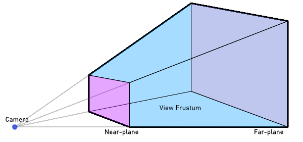

# Shadow mapping
Shadows are an important part of making 3D scenes look realistic. They show where objects are in the world, add depth, and make everything feel more alive. But how do games create shadows that move and change with the light? That’s where *shadow mapping* comes in. Shadow mapping is a way to create dynamic shadows that react to lights and objects in your game. In this article, I’ll explain how shadow mapping works and how I have implemented it.
The code is in [chapter43 in the src folder](../src/).

## Setting the scene

### The basic idea
A shadow appears when light can’t reach a surface because something is blocking it. But as you’ve seen in my previous articles, when we draw an object, the shader doesn’t know about other objects in the scene! So how can we figure out if something is blocking the light? That’s where the *shadow map* comes in.

A shadow map isn’t actually a map of shadows—it’s a map of what the light source can see! By comparing the point we’re drawing on the object to the shadow map, we can figure out if that pixel is in light or shadow. In the next steps, I’ll explain how we create this map and how to use it to determine if something is in shadow.

### The Frustum
An important concept in shadow mapping is the *frustum*. So, what is a frustum? It’s the part of the world visible to the camera, defined by the camera's projection. For a typical perspective view, the frustum looks like this:

In shadow mapping, the frustum is important because it defines the boundaries of what objects are visible and potentially lit in the scene. But there's another frustum in play! To determine which parts of the scene are lit, we need to consider the world from the light source's perspective. 

The shape of the light source's frustum depends on the type of light:
* Spotlight: The frustum is pyramid-shaped, similar to the camera frustum, since the light spreads outward from a point.
* Directional Light: The frustum is shaped like a rectangular box because the light is parallel and uniform, like sunlight.

We focus on where the light's frustum intersects with the camera's frustum. This intersection ensures we only calculate shadows for objects within the visible and illuminated parts of the scene. 


### The shadow map
The other key concept is, of course, the shadow map itself. A shadow map is a texture that represents the world as seen from the light source's point of view. Essentially, it records the depth of each pixel relative to the light source, capturing the distance to the nearest object. An important thing to note is that the shadow map represents the world from the light source's perspective, which is often different from the camera's viewpoint. This means that pixels in the shadow map don’t correspond exactly to pixels from the camera’s view. The farther an object is from the light source, the less precise the shadow map becomes, which can lead to inaccuracies in shadow rendering.

There are solutions to address these inaccuracies, but for now, let’s focus on the basic principle of shadow mapping. To start, we'll create a world small enough for the first shadow map texture to capture sufficient detail. This way, we can observe how shadows from nearby objects work before diving into more advanced techniques for improving distant shadow precision.

### Shaders
For this example, I will split generating the shadow map and rendering the final scene in two separate shaders or `effect.fx` files. It is perfectly possible to combine these as `Technique` in one shader file. However for clarity of this article I will keep these separate. If you are more experienced, feel free to combine!

## The Code
Let's get to work. The code is available in this repo, so I'll guide step by step how things work. As a base I'll use the cube object that has been a staple in this series.

### The Light
The following code is a simple directional lightsource. The trick is that this one simply defines a direction and has the calculations to find the `viewprojection` from that lightsource point of view. I have added comments in the code to illustrate what is happening:

```csharp
 public class ShadowCastingLight
    {
        private Vector3 _lightDirection;

        public ShadowCastingLight(Vector3 lightDirection)
        {
            _lightDirection = Vector3.Normalize(lightDirection);
        }

        public Vector3 LightDirection
        {
            get
            {
                return _lightDirection;
            }
            set
            {
                _lightDirection = Vector3.Normalize(value);
            }
        }

        // The reason this function has the camera projection
        // as a separate parameter is so this can create a cascading shadowmap.
        public Matrix CalculateMatrix(Matrix cameraView, Matrix cameraProjection)
        {
            // Generate the frustum of the camera for which we're casting the shadow
            // Here we obtain the shape of the frustum as it points into the 3D world.
            // We need this so we know what area of the world we observe in our 
            // shadowmap.
            BoundingFrustum cameraFrustum = new BoundingFrustum(cameraView * cameraProjection);


            // Next, we generate the frustum of the lightsource.
            // Our light is directional, so we need to encompass the entire 
            // camera frustum as our light affects the entire scene in the frustum:
                        
            // Get the corners of the frustum
            Vector3[] frustumCorners = cameraFrustum.GetCorners();

            // Transform the positions of the corners into the direction of the light
            // Create Matrix to rotate point in the direction of the light;
            Matrix RotateInLightDirection = Matrix.CreateLookAt(Vector3.Zero, -_lightDirection, Vector3.Up);

            // Perform the rotation
            for (int i = 0; i < frustumCorners.Length; i++)
            {
                frustumCorners[i] = Vector3.Transform(frustumCorners[i], RotateInLightDirection);
            }

            // Find the smallest box around the points
            BoundingBox lightBoundingBox = BoundingBox.CreateFromPoints(frustumCorners);
            Vector3 boxSize = lightBoundingBox.Max - lightBoundingBox.Min;


            // The position of the light should be in the center
            // of the back side of the boundingbox. 
            Vector3 halfBoxSize = boxSize * 0.5f;
            Vector3 lightPosition = lightBoundingBox.Min + halfBoxSize;
            lightPosition.Z = lightBoundingBox.Min.Z;

            // We need the position everything back into world coordinates
            // to do this we transform position by the inverse of the lightrotation we calculated earlier
            lightPosition = Vector3.Transform(lightPosition, Matrix.Invert(RotateInLightDirection));

            // Create the view matrix
            Matrix lightView = Matrix.CreateLookAt(lightPosition,
                                                   lightPosition - _lightDirection,
                                                   Vector3.Up);

            // Finally, create the projection matrix for the light
            // The projection is orthographic, because the light is a directional light.
            Matrix lightProjection = Matrix.CreateOrthographic(boxSize.X, boxSize.Y,
                                                               -boxSize.Z, boxSize.Z);

            // Store the calculated Matrix. View and Projection are combined for ease of use later
            return lightView * lightProjection;
        }

    }
```

The key concepts in the code:
* **Light Direction**
The class accepts a normalized Vector3 to define the direction of the light. This determines how the light rays hit the scene.
* **Camera Frustum**
The CalculateMatrix method uses the camera's view-projection matrix to compute its frustum. This frustum defines the visible area of the world for which we want to calculate shadows.
* **Light's Bounding Box**
By transforming the camera frustum's corners into the light's space, the code calculates a bounding box that encapsulates the frustum. This bounding box determines the area the light "sees" and, consequently, the area to render in the shadow map.
* **Orthographic Projection**
Because the light is directional, an orthographic projection is used. Orthographic projection simulates parallel rays of light.
* **Light's View-Projection Matrix**
The final result is the light's view-projection matrix, which combines the view matrix and the projection matrix that determines the volume of the world the light will render (based on the bounding box).

### The shadow map shader
The shadow map's Vertex and Pixel shaders are surprisingly simple:

```HLSL
ShadowMapVSOutput ShadowMapVS(VertexShaderInput input)
{
    ShadowMapVSOutput output;

    // Calculate position as usual- the ViewProjection Matrix already takes
    // the new light frustum into account.
    output.Position = mul(input.Position, mul(World, ViewProjection));
    
    // Calculate depth. The division by the W component brings the component
    // into homogenous space- which means the depth is normalized on a 0-1 scale.
    output.Depth = output.Position.z / output.Position.w; 

    return output;
}

float4 ShadowMapPS(ShadowMapVSOutput input) : COLOR
{
    // Store depth in the red component.
    return float4(input.Depth,0,0,1); 
}
```
Since the shader accepts the `ViewProjection` of the lightsource to calculate the location of the pixel and we write the normalized depth in the red component so we can check it later when drawing the final scene. We just need a `Rendertarget2D`:

```csharp
    _shadowMapRenderTarget = new RenderTarget2D(GraphicsDevice, 4096, 4096, false,
                                SurfaceFormat.Single,
                                DepthFormat.Depth24);
```
The resolution is 4096x4096, to get the most details out of the shadows. Remember, the light frustum is calculated to encompass the entire camera frustum. The bigger the camera frustum, the less space the texture has to hold the entire scene data[^1]

### The diffuse shader
To render the final scene a shader is used. The full shader can be found in [the code](../src/Chapter43/Content/DiffuseEffect.fx). Let's focus on the actual shadow component in the code:

```HLSL
float4 MainPS(VertexShaderOutput input) : COLOR
{

    // ...
    
    // Find the position of this pixel in light space in the projection
    float4 lightingPosition = mul(input.Position3D, LightViewProjection);
    
    lightingPosition.xyz = 0.5 * lightingPosition.xyz / lightingPosition.w; // transform into homogenous space
    
    // Check if the found pixel is inside the light frustum
    if (lightingPosition.x > -0.5 && lightingPosition.x<0.5 && lightingPosition.y>-0.5 && lightingPosition.y < 0.5)
    {
        lightingPosition = mul(input.Position3D, LightViewProjection);

        // Find the position in the shadow map for this pixel
        float2 ShadowTexCoord = 0.5 * lightingPosition.xy /
            lightingPosition.w + float2(0.5, 0.5);
        
        // Rendering y coordinate needs flipping
        // sampling and rendering from a different y direction.
        ShadowTexCoord.y = 1.0f - ShadowTexCoord.y;

        // Get the current depth stored in the shadow map (red component for close)
        float shadowdepth = tex2D(shadowSampler, ShadowTexCoord).r;

        // Calculate the current pixel depth
        // The bias is used to prevent floating point errors that occur when
        // the pixel of the occluder is being drawn
        float ourdepth = (lightingPosition.z / lightingPosition.w) - DepthBias;
        
        // Check to see if this pixel is in front or behind the value in the shadow map
        if (shadowdepth < ourdepth)
        {
            // Shadow the pixel by multiplying by the shadowstrength
            diffuse.rgb *= ShadowStrength;
        }
    }
    
    return diffuse;
}
```
This code picks the 3D value of the fragment, and uses the light matrix to find the corresponding pixel in our shadowmap. The shadow depth is read and based on the depth of the pixel the result is in the shade or not.


[^1]: This is something that can be solved using Cascading Shadow Maps, the camera frustum is separated in 3 or 4 sections ranging from small increasing in size and distance. This makes it so that nearby shadows are detailed but far shadows are less detailed- which is okay for distant shadows.


